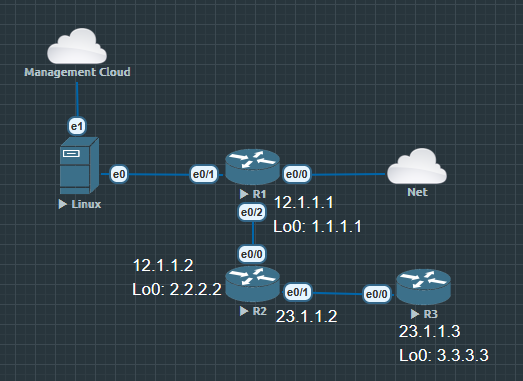

# Learning Objectives

完成本节后，你应该能够：

- 理解 for 的本质

- 理解 Iterable（可迭代对象）

- 区分"遍历对象"和"遍历索引"

- 掌握 enumerate()

- 在 Cisco 自动化中使用 



## 为什么不用 range(len())？

### 写法一（Python 推荐）

```
for device in devices:
    print(device)
```

读起来就是: 对每一台设备执行操作。

### 写法二（传统写法）

```
for i in range(len(devices)):
    print(devices[i])
```

读起来：遍历所有索引，再根据索引找到设备。虽然结果一样，但逻辑绕了一圈。

### CCIE Engineer Rule #1

以后在我们的 Workbook 里：

优先使用：

`for device in devices:`

只有确实需要索引时，才考虑：

`for i in range(len(devices)):`

## Cisco Automation Example 1

现在我们有三台设备：

```
devices = [
    "R1",
    "R2",
    "R3"
]
```

我们要登录所有设备：

```
for device in devices:
    print(f"Connecting to {device}")
```

输出：

```
Connecting to R1
Connecting to R2
Connecting to R3
```

## Cisco Automation Example 2（真实 Netmiko）

以后：

```
devices = [
    {
        "host": "10.1.1.1",
        "username": "admin",
        "password": "Cisco123",
        "device_type": "cisco_ios"
    },
    {
        "host": "10.1.1.2",
        "username": "admin",
        "password": "Cisco123",
        "device_type": "cisco_ios"
    }
]
```

然后：

```
for device in devices:
    conn = ConnectHandler(**device)

    output = conn.send_command(
        "show ip interface brief"
    )

    print(output)

    conn.disconnect()
```

这就是企业里面每天都会写的代码。

你会发现, 整个程序真正变化的只有 `device` 每一次循环都是一台新的设备。

## enumerate()

有时候我们需要第几台设备。

例如：

```
Connecting Device 1
Connecting Device 2
Connecting Device 3
```

推荐：

```
for index, device in enumerate(devices, start=1):
    print(index, device)
```

输出：

```
1 R1
2 R2
3 R3
```

为什么不用：

```
i + 1
```

因为 Python 已经提供了 `enumerate()` 不用重复造轮子。

## lab2.9.py

运行 [lab2.9](python/lab2.9.py) 这个 python 文件会得到结果

```
Connecting to R1
IP Address: 10.1.1.1
------------------------------

Connecting to R2
IP Address: 10.1.1.2
------------------------------

Connecting to R3
IP Address: 10.1.1.3
------------------------------
```

遍历 List，再访问每个 Dictionary。

这是自动化项目中最经典、最常见的模式。

自动化真正的核心就是 `for device in devices:`

Netmiko

```
for device in devices:
    ConnectHandler(**device)
```

NAPALM

```
for device in devices:
    driver(**device)
```

REST API

```
for device in devices:
    requests.get(...)
```

PyATS

```
for device in testbed.devices.values():
```

**变化的是框架，不变的是 Python 的数据结构和循环方式。**