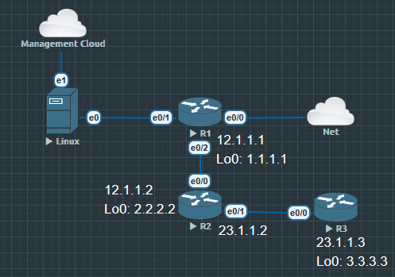

# Learning Objectives

完成本节后，你应该能够：

- 理解 Netmiko 在整个 Python 网络自动化生态中的定位

- 在 Ubuntu 22.04 上创建独立的 Python 开发环境

- 安装 Netmiko 及相关依赖

- 验证 Netmiko 是否能够正常工作

- 理解 `ConnectHandler()` 的设计思想

- 搭建企业级 Automation Project 的开发环境

#### Python Package 是什么？

Chapter 2 我们学习了：

```
import time
import os
import json
```
这些都是 Module。而 Netmiko 属于 Third-party Package（第三方软件包）它不是 Python 官方提供的，而是由社区维护。

#### 为什么需要 Virtual Environment？

很多初学者认为电脑只有一个 Python。

实际上，一个企业服务器可能同时运行多个自动化项目：

```
Server

├── Project A
│      Python 3.10
│      Netmiko 4.3
│
├── Project B
│      Python 3.11
│      Nornir
│
└── Project C
       Ansible
```

如果所有项目都共用一个 Python 环境：

System Python

↓

所有项目共享

那么升级一个库：

pip install --upgrade netmiko

可能导致另一个项目无法运行。

因此企业采用：

Project

↓

Virtual Environment

↓

Independent Packages

每个项目拥有独立依赖。这就是 Python 工程化开发的基础。

## 为什么这样设计

为什么企业项目几乎都会包含一个 venv？

原因包括：

- 避免不同项目之间的依赖冲突

- 保证开发、测试、生产环境一致

- 便于版本管理与持续集成（CI）

- 可以通过 requirements.txt 快速重建环境

因此 **Virtual Environment 是工程实践，不是 Netmiko 的要求。**

## Cisco Automation Perspective

对于网络自动化来说，一个项目可能包含：

- Netmiko

- NAPALM

- Nornir

- TextFSM

- TTP

- Jinja2

- PyYAML

如果这些都安装到系统 Python 以后维护几乎会变成灾难。

所以企业项目通常都是：

```
automation_project/
│
├── venv/
├── scripts/
├── inventory/
├── configs/
└── requirements.txt
```

## Cisco Implementation

### Step 1

确认 Python 版本。

`python3 --version`

预期：

`Python 3.10.x`

### Step 2

创建项目目录。

建议：

```
mkdir automation_project
cd automation_project
```

观察：

`pwd`

确保已经进入项目目录。

```
user@ubuntu22-desktop:~/automation_project$ pwd
/home/user/automation_project
```

### Step 3

创建 Virtual Environment。

`python3 -m venv venv`

目录变为：

```
automation_project/
├── venv/
```

### Step 4

激活环境。

`user@ubuntu22-desktop:~/automation_project$ source venv/bin/activate`

成功后终端通常变成：

`(venv) user@ubuntu22-desktop:~/automation_project$`

这是一个非常重要的标志。以后安装的所有 Package 都进入：

```
venv/
↓
site-packages
```

不会影响系统 Python。

### Step 5

升级 pip。

建议：

`pip install --upgrade pip`

不是必须。但企业通常第一步都会升级。

### Step 6

安装 Netmiko。

`pip install netmiko`

安装过程中会自动下载：

- Paramiko

- cryptography

- bcrypt

- cffi

- invoke

- pynacl

- scp

这些都是正常依赖。

### Step 7

验证安装。

执行：

`pip show netmiko`

例如：

```
Name: netmiko
Version: 4.x
Location:
```

说明安装成功。

### `Verify

查看：

`pip list`

应该能够看到类似内容：

```
netmiko
paramiko
cryptography
scp
```

说明整个 SSH 自动化依赖链已经安装完成。

## 第一个 Netmiko 测试

先不要连接 Cisco。只验证 Python 能否导入 Netmiko。

创建：test_import.py

内容：

```
from netmiko import ConnectHandler
print("Netmiko Installed Successfully")
```

运行 `python3 test_import.py`

如果输出：

`Netmiko Installed Successfully`

说明 Python → Netmiko 已经没有问题。

## Analyze

到目前为止我们还没有连接任何 Cisco。为什么还要做这一系列验证？

因为如果这里都失败 

```
ImportError
ModuleNotFoundError
```

以后 SSH, Cisco, EVE 全部不用检查。问题就在 Python 环境。

这就是 Observe → Verify → Analyze 的意义。

企业排障永远从最底层开始。

## ConnectHandler 是什么？

很多教程直接告诉你：

```
ConnectHandler(
    device_type="cisco_ios",
    host="10.10.10.11",
    username="admin",
    password="cisco123"
)
```

但没有解释为什么叫 `ConnectHandler` 而不是 `SSHLogin()`, `Cisco()`, `Router()`

原因Netmiko 支持：

- Cisco IOS

- Cisco NX-OS

- Cisco IOS-XR

- Cisco ASA

- Arista EOS

- Juniper Junos

- HP ProCurve

- Dell OS10

- Linux

- Palo Alto（部分支持）

因此它不能写成 `Cisco()`

而是

```
ConnectHandler
↓
根据 device_type
↓
自动选择对应 Driver
```

例如 `device_type="cisco_ios"` Netmiko 自动创建 CiscoIosSSH 对象。

如果 `device_type="arista_eos"` 创建 AristaSSH

因此 `ConnectHandler` 更像一个 Factory（工厂）函数。目前你不需要深入学习设计模式，只需要知道它根据 device_type 自动创建合适的连接对象。

## EVE-NG Lab



### Observe

确认 R1 已启动。Ubuntu：`ping 12.1.1.1` 不要急于运行 Python。先确认网络是否正常。

### Verify

使用 OpenSSH：ssh admin@12.1.1.1 确认SSH 可以登录。如果 SSH 都不能登录 Netmiko 一定失败。

### Analyze

确认问题属于：

- 网络？

- SSH？

- Python？

- Netmiko？

不要混在一起分析。

### Configure

本节无需修改 Cisco 配置。只完成 Python 环境搭建。

### Verify Again

执行 `python3 test_import.py` 确认 Netmiko 可以正常导入。

# Troubleshooting

| 现象                             | 原因                   | 解决方案                                       |
| ------------------------------ | -------------------- | ------------------------------------------ |
| `ModuleNotFoundError: netmiko` | 未安装 Netmiko，或未激活虚拟环境 | 激活 `venv` 后重新安装                            |
| `pip: command not found`       | pip 未安装              | `python3 -m ensurepip` 或安装 `python3-pip`   |
| `Permission denied`            | 使用系统目录安装             | 不使用 `sudo pip`，改用虚拟环境                      |
| `python` 与 `python3` 混用        | 不同解释器                | 使用 `which python3`、`which pip` 确认路径        |
| 导入失败但 `pip show netmiko` 存在    | 安装到另一个 Python 环境     | 使用 `python3 -m pip show netmiko` 检查解释器是否一致 |

## Engineering Notes（企业最佳实践）

1. 固定依赖版本

安装完成后，立即导出依赖：

`pip freeze > requirements.txt`

这样团队成员可以通过：

`pip install -r requirements.txt`

重建完全一致的开发环境。

2. 不要提交虚拟环境

.gitignore 中至少包含：

```
venv/
__pycache__/
*.pyc
```

Git 应提交源代码，而不是整个 Python 环境。

3. 不要硬编码凭据

虽然后续实验会暂时使用：

```
username = "admin"
password = "cisco123"
```

但在企业环境中，应逐步迁移到：

- 环境变量

- 加密凭据管理

- 密钥认证

- AAA（TACACS+/RADIUS）

4. 统一开发环境

建议整个 Workbook 都使用：

- Ubuntu 22.04

- Python 3.10

- 独立 venv

- VS Code

避免中途切换 Python 版本或混用多个环境。

# Chapter Summary

本节完成了 Netmiko 开发环境的搭建，并建立了工程化开发的基础：

- 理解了 Netmiko 在 Python 网络自动化生态中的位置。

- 学会使用 Virtual Environment 管理项目依赖。

- 完成 Netmiko 及其依赖库的安装与验证。

- 理解了 ConnectHandler() 作为连接工厂的设计思想。

- 建立了后续所有自动化实验统一的开发环境。