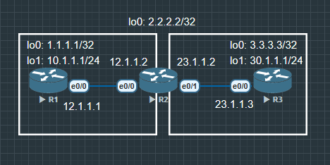

实验目标： 三台路由器，R1 运行 OSPF，R3 运行 EIGRP，R2 同时运行两个协议并做双向重分发。



## R1

```
R1(config)#router ospf 110
R1(config-router)#router-id 1.1.1.1

R1(config)#int lo0
R1(config-if)#ip address 1.1.1.1 255.255.255.255
R1(config-if)#no shu
R1(config-if) ip ospf 110 area 0

R1(config)#int lo1
R1(config-if)#ip address 10.1.1.1 255.255.255.0
R1(config-if)#no shu
R1(config-if) ip ospf 110 area 0

R1(config)#int e0/0
R1(config-if)#ip address 12.1.1.1 255.255.255.0
R1(config-if)#no shu
R1(config-if)#description To_R2
```

## R2

```
R2(config)#router os 110
R2(config-router)#router-id 2.2.2.2

R2(config)#router eigrp CCIE_LAB
R2(config-router)#address-family ipv4 unicast autonomous-system 100
R2(config-router)#eigrp router-id 2.2.2.2

R2(config)#int lo0
R2(config-if)#ip address 2.2.2.2 255.255.255.255
R2(config-if)#no shu
R2(config-if)#ip ospf 110 area 0

R2(config)#int e0/0
R2(config-if)#ip address 12.1.1.2 255.255.255.0
R2(config-if)#no shu
R2(config-if)#ip ospf 110 area 0
R2(config-if)#description To_R1_OSPF

R2(config)#int e0/1
R2(config-if)#ip address 23.1.1.2 255.255.255.0
R2(config-if)#no shu
R2(config-if)#description To_R3_EIGRP

R2(config)#router eigrp CCIE_LAB
R2(config-router-af)#eigrp router-id 2.2.2.2
R2(config-router-af)#network 2.2.2.2 0.0.0.0
R2(config-router-af)#network 23.1.1.0 0.0.0.255
```

## R3

```
R3(config)#int lo0
R3(config-if)#ip address 3.3.3.3 255.255.255.255
R3(config-if)#no shu

R3(config)#int lo1
R3(config-if)#ip address 30.1.1.1 255.255.255.0
R3(config-if)#no shu

R3(config)#int e0/0
R3(config-if)#ip address 23.1.1.3 255.255.255.0
R3(config-if)#no shu
R3(config-if)#description To_R2

R3(config)#router eigrp CCIE_LAB
R3(config-router)#address-family ipv4 unicast autonomous-system 100
R3(config-router-af)#eigrp router-id 3.3.3.3
R3(config-router-af)#network 3.3.3.3 0.0.0.0
R3(config-router-af)#network 30.1.1.0 0.0.0.255
R3(config-router-af)#network 23.1.1.0 0.0.0.255
```
### 验证与 PS

1. Named EIGRP vs Classic EIGRP：

    - Named 模式用 address-family 结构
    
    - 支持 IPv4+IPv6 统一管理，是 CCIE 考试推荐写法
     
    - Classic 写法是 router eigrp 100 + network 语句，功能相同但 Named 更灵活

2. 验证 OSPF 邻居
    
    - `R2#show ip ospf neighbor`

    ```
    Neighbor ID     Pri   State           Dead Time   Address         Interface
    1.1.1.1           1   FULL/DR         00:00:39    12.1.1.1        Ethernet0/0
    ```

3. 验证 EIGRP 邻居
    
    - `R2#show eigrp address-family ipv4 neighbors`

    ```
    EIGRP-IPv4 Neighbors for AS(90)
    H   Address                 Interface              Hold Uptime   SRTT   RTO  Q  Seq
                                                   (sec)         (ms)       Cnt Num
       23.1.1.3                Et0/1                    14 00:16:33    7   100  0  3
    ```

## 重分布

```
R2(config)#router ospf 110
R2(config-router)#redistribute eigrp 100 subnets

R2(config)#router eigrp CCIE_LAB
R2(config-router)#address-family ipv4 unicast autonomous-system 100
R2(config-router-af)#topology base
R2(config-router-af-topology)#redistribute ospf 1 metric 10000 100 255 1 1500
```

## 当前配置存在路由反馈问题。OSPF 重分发进 EIGRP 的路由，可能被 EIGRP 再重分发回 OSPF，形成次优路由甚至路由震荡。

R2 — 完整的带 Tag 防环的重分发配置

```
--- 定义 route-map：OSPF → EIGRP ---
R2(config)#route-map OSPF_TO_EIGRP deny 10
R2(config-route-map)#match tag 200
deny：拒绝带 tag 200 的路由（这是从 EIGRP 来的，防止反馈）

R2(config)#route-map OSPF_TO_EIGRP permit 20
R2(config-route-map)#set tag 100
permit：允许其余路由，打上 tag 100（标记"来自OSPF"）

--- 定义 route-map：EIGRP → OSPF ---
R2(config)#route-map EIGRP_TO_OSPF deny 10
R2(config-route-map)#match tag 100
deny：拒绝带 tag 100 的路由（这是从 OSPF 来的，防止反馈）

R2(config)#route-map EIGRP_TO_OSPF permit 20
R2(config-route-map)#set tag 200
permit：允许其余路由，打上 tag 200（标记"来自EIGRP"）
```

R2 — 应用 route-map 到重分发

```
--- EIGRP 重分发进 OSPF，应用防环 map ---
R2(config)#router ospf 1
R2(config-router)#no redistribute eigrp 100 subnets
R2(config-router)#redistribute eigrp 100 subnets route-map EIGRP_TO_OSPF

--- OSPF 重分发进 EIGRP，应用防环 map ---
R2(config)#router eigrp CCIE_LAB
R2(config-router)#address-family ipv4 unicast autonomous-system 100
R2(config-router-af)#topology base
R2(config-router-af-topology)#no redistribute ospf 1 metric 10000 100 255 1 1500
R2(config-router-af-topology)#redistribute ospf 1 metric 10000 100 255 1 1500 route-map OSPF_TO_EIGRP
```

### 验证

```
R1#show ip route 30.1.1.0
Routing entry for 30.1.1.0/24
  Known via "ospf 1", distance 110, metric 20, type extern 2
  Tag 200, mask 255.255.255.0
Tag 200 确认：这条路由来自 EIGRP 重分发过来的，已打标记

R3#show ip route 10.1.1.0
  Known via "eigrp 100", distance 170, metric 2560000
  Tag 100
Tag 100 确认：这条路由来自 OSPF 重分发过来的，已打标记
```

SPF 起源的路由被打 tag 100 → 进入 EIGRP 后若被反向重分发回 OSPF，route-map 看到 tag 100 就 deny，避免环路。EIGRP 起源的路由被打 tag 200，同理。


## 核心排错命令速查

**--- 路由表排错 ---**

`show ip route`                          # 全局路由表

`show ip route ospf`                     # 只看 OSPF 路由

`show ip route eigrp`                    # 只看 EIGRP 路由

`show ip route 10.1.1.0`                 # 查某条路由详情（含 Tag）

**--- OSPF 排错 ---**

`show ip ospf neighbor`                  # 邻居是否 FULL

`show ip ospf database external`         # 查外部路由 LSA（Type-5）

`show ip ospf database | inc External`   # 快速定位

**--- EIGRP 排错 ---**

`show eigrp address-family ipv4 neighbors`   # 邻居状态

`show ip eigrp topology`                     # 拓扑表（含 FC 计算）

`show ip eigrp topology 10.1.1.0/24`         # 某条路由的 Successor/FS

**--- 重分发排错 ---**

`show route-map EIGRP_TO_OSPF`           # 查 permit/deny 匹配计数

`show route-map OSPF_TO_EIGRP`           # matches 为 0 说明没触发

`debug ip ospf redistribute`             # 实时看重分发过程（谨慎）

### 常见问题： 

1. EIGRP 重分发后路由不出现 → 忘记写 metric，必须加 5 个值 

2. OSPF 重分发后路由不出现 → 忘记加 subnets 关键字 

3. route-map 没生效 → 用 show route-map 看 matches 计数是否增加 

4. R1 ping 不通 R3 → 先 traceroute 看卡在哪跳，再看对应路由器的路由表