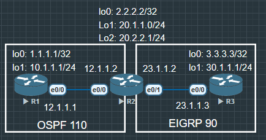

## 条件

- 实验A: EIGRP Stub：控制 R3 不被当作中转路由器，减少查询范围

    1. R3 声明 Stub，R2 不向 R3 发 Query

- OSPF distribute-list：在 R1 或 R2 上过滤特定路由进出路由表

    1. R1 过滤掉 20.2.2.0/24，不装入路由表



## EIGRP Query 机制 & Stub 的作用

1. **EIGRP Query 问题**

- 当 EIGRP 路由丢失且没有 Feasible Successor 时，路由器会向所有邻居发送 Query 查询消息，询问"有没有去往该目的地的路由？"邻居收到后必须回复 Reply，否则路由器会一直等待（SIA — Stuck In Active），超时后断开邻居关系。

    - 在大型网络中，Query 会像涟漪一样扩散到整个 EIGRP 域，造成收敛缓慢甚至邻居震荡。

2. **Stub 路由器的作用**

- 将 R3 配置为 Stub 后，R2 会知道"不用向 R3 发 Query"，因为 R3 是末端站点，不可能是去往其他网络的中转。这样 Query 的扩散范围被大幅缩小，收敛更快。

    - *Stub 路由器可以宣告哪些路由：*

    1. stub connected（默认）— 只宣告直连路由

    2. stub summary — 宣告汇总路由

    3. stub redistributed — 宣告重分发路由

    3. stub receive-only — 不宣告任何路由，只接收（最严格）

3. **distribute-list 过滤**

- OSPF distribute-list 作用于路由器本地，控制哪些路由能进入路由表（in）或被宣告出去（out）。注意：它不影响 OSPF 的 LSA 泛洪，只过滤本地 RIB 的安装。

    1. distribute-list ... in — 过滤进入路由表的路由（最常用）

    2. distribute-list ... out — 过滤重分发时宣告的路由

    3. 可以用 ACL 或 prefix-list 做匹配条件

## 实验A — OSPF distribute-list 入向过滤

### 配置 1 ACL 过滤

```
R1#show ip route ospf | inc 20
      20.0.0.0/32 is subnetted, 2 subnets
O        20.1.1.1 [110/11] via 12.1.1.2, 00:14:16, Ethernet0/0
O        20.2.2.1 [110/11] via 12.1.1.2, 00:14:16, Ethernet0/0
```
两条路由都出现在 R1 的路由表中。

下一步：让 R1 过滤掉 20.2.2.0/24，只保留 20.1.1.0/24。

1. ACL 过滤

```
R1(config)#ip access-list standard FILTER_20_2
R1(config-std-nacl)#deny 20.2.2.0 0.0.0.255
R1(config-std-nacl)#permit any
//deny 目标网段，permit any 放行其余所有路由

R1(config)#router ospf 110
R1(config-router)#distribute-list FILTER_20_2 in
//in = 过滤进入本地路由表的 OSPF 路由
//不指定接口则对所有 OSPF 接口生效
```

#### 验证

```
R1(config-router)#do show ip route os | inc 20
O        20.1.1.1 [110/11] via 12.1.1.2, 00:00:12, Ethernet0/0
```

20.2.2.0/24 被 ACL 过滤掉了, 但是 distribute-list in 是不会阻止 LSA 泛洪, 20.2.2.0/24 的 LSA 依旧在数据中, 只是没有安装到路由表里

### 配置 2 prefix-list 过滤

```
R1(config)#ip prefix-list DENY_20_2 seq 5 deny 20.2.2.0/24
R1(config)#ip prefix-list DENY_20_2 seq 10 permit 0.0.0.0/0 le 32
//prefix-list 比 ACL 更精确，可以匹配掩码长度范围
//le 32 = 允许所有前缀（掩码 0~32 位）

R1(config)#router os 110
R1(config-router)#distribute-list prefix DENY_20_2 in
```


#### 验证

如果没有拦截, 可以考虑是否是因为 OSPF 把 R2 loopback 以 /32 的掩码发布出去了.

```
R1#show ip route 20.2.2.1
Routing entry for 20.2.2.1/32
  Known via "ospf 110", distance 110, metric 11, type intra area
  Last update from 12.1.1.2 on Ethernet0/0, 00:03:23 ago
  Routing Descriptor Blocks:
  * 12.1.1.2, from 2.2.2.2, 00:03:23 ago, via Ethernet0/0
      Route metric is 11, traffic share count is 1

// 前缀列表改为
R1(config)#ip prefix-list DENY_20_2 seq 5 deny 20.2.2.0/24 le 32

// R2 修改 lo2 配置
R2(config)#int lo2
R2(config-if)#ip ospf network point-to-point

```

```
R1#show ip prefix-list DENY_20_2
ip prefix-list DENY_20_2: 2 entries
   seq 5 deny 20.2.2.0/24
   seq 10 permit 0.0.0.0/0 le 32
```

## 实验B — EIGRP Stub 配置

### 配置
```
R2#show ip eigrp neighbors detail
EIGRP-IPv4 Neighbors for AS(90)
H   Address                 Interface              Hold Uptime   SRTT   RTO  Q  Seq
                                                   (sec)         (ms)       Cnt Num
0   23.1.1.3                Et0/1                    11 00:00:03   13   100  0  12
   Version 23.0/2.0, Retrans: 0, Retries: 0, Prefixes: 2
   Topology-ids from peer - 0
   Topologies advertised to peer:   base

Max Nbrs: 0, Current Nbrs: 0
// 现在 R2 上查看邻居是正常的
```

```
R3(config)#router eigrp 90
R3(config-router)#eigrp stub connected summary
```

##### 验证

```
R2#show ip eigrp neighbors detail
EIGRP-IPv4 Neighbors for AS(90)
H   Address                 Interface              Hold Uptime   SRTT   RTO  Q  Seq
                                                   (sec)         (ms)       Cnt Num
0   23.1.1.3                Et0/1                    12 00:00:03   13   100  0  14
   Version 23.0/2.0, Retrans: 0, Retries: 0, Prefixes: 2
   Topology-ids from peer - 0
   Topologies advertised to peer:   base

   Stub Peer Advertising (CONNECTED SUMMARY ) Routes
   Suppressing queries
Max Nbrs: 0, Current Nbrs: 0
```

R2 知道 R3 是 stub 了

1. Stub 前（Query 扩散）

    - R2 丢失路由

    - Query → R3

    - R3 必须回 Reply

    - 若 R3 也不知道

    - SIA 风险!

2. Stub 后（Query 被抑制）

    - R2 丢失路由

    - 不向 R3 发 Query

    - 收敛更快

    - 无 SIA 风险

##### 进阶-Stub 类型对比 & 选择指南

|:--------------------:|:-------------:|:----------------:|
|命令                  |宣告路由类型    |典型场景           |
|stub connected        |直连路由（默认）|分支站点只有直连网段|
|stub connected summary|直连 + 汇总路由 |分支有汇总需求     |
|stub redistributed    |重分发路由      |分支连接其他协议   |
|stub summary          |只宣告汇总      |严格汇总控制       |
|stub receive-only     |不宣告任何路由   |纯接收，只做客户端|

1. Stub 路由器不能作为中转（Transit）。如果 R3 后面还有其他路由器需要通过 R3 到达 R2，配置 Stub 会导致那些路由器失联。

2. receive-only 最严格，R3 完全不宣告路由，其他路由器无法通过 R3 到达 R3 自己的网段。

3. 考题可能问"为什么某路由器收不到 Query"，答案很可能就是对端配置了 Stub。

##### 进阶-distribute-list 进阶 — out 方向过滤

- R2 重分发时，不把 20.2.2.0/24 宣告给进 EIGRP 

命名模式的配置, 非命名模式直接 distribute ...

```
R2(config)#ip prefix-list DENY_OUT seq 5 deny 20.2.2.0/24
R2(config)#ip prefix-list DENY_OUT seq 10 permit 0.0.0.0/0 le 32

R2(config)#router eigrp CCIE_LAB
R2(config-router)#address-family ipv4 unicast autonomous-system 100
R2(config-router-af)#topology base
R2(config-router-af-topology)#distribute-list prefix DENY_OUT out ospf 1
//out ospf 1 = 过滤从 OSPF 1 重分发出去的路由
//不指定 source protocol 则过滤所有 out 方向路由
```

```
R3#show ip route eigrp | inc 20.2
R3#
```

- in vs out 总结对比

|:--:|:-------------:|:-------------:|:--------------------:|
|方向|作用位置        |影响范围        |典型用途               |
|in  |本地路由器安装时|只影响自己的 RIB |防止某路由进入本地路由表|
|out |重分发/更新发出时|影响邻居的 RIB |控制向外宣告什么路由     |

## 完整排错命令速查

--- distribute-list 排错 ---

`show ip prefix-list [name]`           # 查看命中计数

`show ip ospf database`                # 确认 LSA 还在（只是没装入 RIB）

`show ip route [prefix]`               # 确认路由是否在路由表

--- EIGRP Stub 排错 ---

`show eigrp address-family ipv4 neighbors detail`   # 看 Stub 状态和 Suppressing queries

`show ip eigrp topology`                            # 查看拓扑表

`debug eigrp packets query reply`                   # 实时查看 Query/Reply（生产谨慎用）

--- 验证 OSPF 数据库（distribute-list 不影响这里）---

`show ip ospf database external`         # 查外部路由（重分发进来的）

`show ip ospf database summary`          # 查汇总路由

实验1（上次）  OSPF ↔ EIGRP 重分发 + tag 防环
               → 掌握：多协议共存、route-map、防次优路由

实验2A（本次） OSPF distribute-list 入向过滤
               → 掌握：本地 RIB 过滤、prefix-list 精确匹配

实验2B（本次） EIGRP Stub 路由器
               → 掌握：Query 抑制、收敛优化、Stub 类型选择


