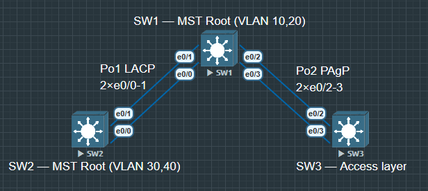

# EtherChannel 协商模式对照表

将多条物理链路绑定成一条逻辑链路（Port-Channel），同时提升带宽和冗余。

两端必须协商一致才能成功聚合，否则物理接口 up 但 Po 接口 down。

|协议|模式|行为|对端要求|
|:---:|:---:|:---:|:---:|
|LACP (802.3ad)|active|主动发|LACP PDU|active 或 passive|
|LACP (802.3ad)|passive|被动等待 PDU|必须对端是 active|
|PAgP (Cisco)|desirable|主动发 PAgP PDU|desirable 或 auto|
|PAgP (Cisco)|auto|被动等待 PDU|必须对端是 desirable|
|静态|on|强制聚合，不发 PDU|对端也必须是 on|

**passive + passive = 不聚合（两端都不主动）**

- auto + auto = 不聚合（同上）

- on + active/passive/desirable/auto = 不聚合（on 不理解协议 PDU）

- *Lab 考试陷阱：题目说"用 LACP"，两端都配 passive 就不会聚合，必须至少一端 active。*

- EtherChannel 负载均衡算法（load-balance）

    1. src-mac / dst-mac / src-dst-mac（基于 MAC）

    2. src-ip / dst-ip / src-dst-ip（基于 IP，推荐）

    3. src-port / dst-port（基于端口）

- *算法决定流量分到哪条物理链路，两端可以不同。*
- *默认通常是 src-dst-ip，单流量不会因为聚合而翻倍带宽，只有多流量才能均衡。*

## 配置 step 1

**SW1-SW2 LACP EtherChannel**

**SW1 LACP active**

```
SW1(config)#int range e0/0-1
SW1(config-if-range)#switchport trunk encapsulation dot1q
SW1(config-if-range)#switchport mode trunk
SW1(config-if-range)#channel-group 1 mode active
//先配 trunk 再加入 channel-group，顺序不能反
SW1(config-if-range)#no shu

SW1(config)#int po1
SW1(config-if)#switchport trunk encapsulation dot1q
SW1(config-if)#switchport mode trunk
SW1(config-if)#switchport trunk allowed vlan 10,20,30,40
```

**SW2 LACP passive**

```
SW2(config)#int range e0/0-1
SW2(config-if-range)#switchport trunk encapsulation dot1q
SW2(config-if-range)#switchport mode trunk
SW2(config-if-range)#channel-group 1 mode passive
SW2(config-if-range)#no shu

SW2(config)#int po1
SW2(config-if)#switchport trunk encapsulation dot1q
SW2(config-if)#switchport mode trunk
SW2(config-if)#switchport trunk allowed vlan 10,20,30,40
```

### 验证

```
SW1#show etherchannel summary
...

Number of channel-groups in use: 1
Number of aggregators:           1

Group  Port-channel  Protocol    Ports
------+-------------+-----------+-----------------------------------------------
1      Po1(SU)         LACP      Et0/0(P)    Et0/1(P)
//SU = Layer2(S) + in-use(U)，P = bundled（成功聚合）
//如果看到 I(stand-alone) 或 D(down)，说明协商失败
```

```
SW1#show lacp neighbor
...

Channel group 1 neighbors

Partner's information:

                  LACP port                        Admin  Oper   Port    Port
Port      Flags   Priority  Dev ID          Age    key    Key    Number  State
Et0/0     SP      32768     aabb.cc80.2000   5s    0x0    0x1    0x1     0x3C
Et0/1     SP      32768     aabb.cc80.2000  11s    0x0    0x1    0x2     0x3C
```

*常见失败原因：*

两端 VLAN 允许列表不一致、encapsulation 不一致、speed/duplex 不一致。Po 接口的配置优先级高于成员接口，但如果成员接口有冲突配置会导致 err-disabled。

## Step 2 

**SW1-SW3 PAgP EtherChannel**

SW1 PAgP desirable

```
SW1(config)#int range e0/2-3
SW1(config-if-range)#switchport trunk encapsulation dot1q
SW1(config-if-range)#switchport mode trunk
SW1(config-if-range)#channel-group 2 mode desirable
SW1(config-if-range)#no shu

SW1(config)#int po2
SW1(config-if)#switchport trunk encapsulation dot1q
SW1(config-if)#switchport mode trunk
SW1(config-if)#switchport trunk allowed vlan 10,20,30,40
```

SW3 — PAgP desirable + 接入端口

```
SW3(config)#int range e0/2-3
SW3(config-if-range)#switchport trunk encapsulation dot1q
SW3(config-if-range)#switchport mode trunk
SW3(config-if-range)#channel-group 2 mode desirable
SW3(config-if-range)#no shu

SW3(config)#int po2
SW3(config-if)#switchport trunk encapsulation dot1q
SW3(config-if)#switchport mode trunk
SW3(config-if)#switchport trunk allowed vlan 10,20,30,40
```

配置接入端口

```
SW3(config)#vlan 10
SW3(config)#vlan 30

SW3(config)#int e0/0
SW3(config-if)#switchport mode access
SW3(config-if)#switchport access vlan 10

SW3(config)#int e0/1
SW3(config-if)#switchport mode access
SW3(config-if)#switchport access vlan 30
```

### 验证 PAgP 聚合

```
SW1#show etherchannel summary
...

Number of channel-groups in use: 2
Number of aggregators:           2

Group  Port-channel  Protocol    Ports
------+-------------+-----------+-----------------------------------------------
1      Po1(SU)         LACP      Et0/0(P)    Et0/1(P)
2      Po2(SU)         PAgP      Et0/2(P)    Et0/3(P)

SW1#show pagp neighbor
...

Channel group 2 neighbors
          Partner              Partner          Partner         Partner Group
Port      Name                 Device ID        Port       Age  Flags   Cap.
Et0/2     SW3                  aabb.cc80.3000   Et0/2       11s SC      20001
Et0/3     SW3                  aabb.cc80.3000   Et0/3        7s SC      20001
```

## Step 3  MST 配置 VLAN 负载均衡

PVST+：每个 VLAN 一棵 STP 树，100 个 VLAN = 100 个 STP 进程，CPU 开销大。

MST：把 VLAN 映射到少数几个 Instance，每个 Instance 一棵树，大幅减少 STP 开销。

本实验：Instance 1 管 VLAN 10,20（SW1 做根），Instance 2 管 VLAN 30,40（SW2 做根）。

效果：VLAN 10/20 的流量走 SW1，VLAN 30/40 的流量走 SW2，实现负载均衡。

**所有交换机 — MST Region 配置（必须完全一致）**

SW1, SW2, SW3

```
SW1(config)#spanning-tree mode mst
SW1(config)#spanning-tree mst configuration
SW1(config-mst)#name CCIE_LAB
//region 名称，三台必须相同
SW1(config-mst)#revision 1
SW1(config-mst)#instance 1 vlan 10,20
//Instance 1 管理 VLAN 10,20
SW1(config-mst)#instance 2 vlan 30,40
//Instance 2 管理 VLAN 30,40
```

**SW1**

```
SW1(config)#spanning-tree mst 1 priority 4096
//priority 4096 < 默认 32768，SW1 成为 Instance 1 的根

SW1(config)#spanning-tree mst 2 priority 8192
//Instance 2 的备根（SW2 挂了时接管）
```

**SW2**

```
SW2(config)#spanning-tree mst 2 priority 4096
SW2(config)#spanning-tree mst 1 priority 8192
```

### 验证 MST 根选举

```
SW1#show spanning-tree mst 1

##### MST1    vlans mapped:   10,20
Bridge        address aabb.cc00.1000  priority      4097  (4096 sysid 1)
Root          this switch for MST1


SW1#show spanning-tree mst 2

##### MST2    vlans mapped:   30,40
Bridge        address aabb.cc00.1000  priority      8194  (8192 sysid 2)
Root          this switch for MST2
```

MST Region 三要素必须完全一致：name、revision、instance-to-vlan 映射。任何一项不同，交换机会认为对端在不同 Region，按 IST 处理，负载均衡效果消失。用 show spanning-tree mst configuration digest 对比 MD5 值快速验证。

## STP 4 安全增强：BPDU Guard + Root Guard

接入层端口（连接 PC 的端口）必须启用 BPDU Guard，防止恶意或误配的交换机发 BPDU 影响 STP 拓扑。

### 配置

**SW3 接入端口安全加固**

```
//方法一：全局开启 PortFast + BPDU Guard（推荐）
SW3(config)#spanning-tree portfast edge default
//所有 access 端口自动进入 PortFast 模式
SW3(config)#spanning-tree portfast edge bpduguard default
//PortFast 端口收到 BPDU 立即进入 err-disabled 状态

//方法二：单接口配置（更精确）
SW3(config)#int e0/0
SW3(config-if)#spanning-tree portfast
SW3(config-if)#spanning-tree bpduguard enable
```

**SW1/2 Root Guard（保护根桥位置）**

```
//在 SW1 连接 SW3 的端口上启用 Root Guard
//防止 SW3 发出更优的 BPDU 抢占根桥位置
SW1(config)#int po2
SW1(config-if)#spanning-tree guard root
```

#### 验证

```
SW3#show spanning-tree interface e0/0 detail

SW3#show spanning-tree int e0/0 detail
 Port 1 (Ethernet0/0) of MST0 is designated forwarding
   Port path cost 2000000, Port priority 128, Port Identifier 128.1.
   Designated root has priority 32768, address aabb.cc00.1000
   Designated bridge has priority 32768, address aabb.cc00.3000
   Designated port id is 128.1, designated path cost 0
   Timers: message age 0, forward delay 0, hold 0
   Number of transitions to forwarding state: 1
   The port is in the portfast edge mode by default
   Link type is point-to-point by default, Internal
   Bpdu guard is enabled by default
   PVST Simulation is enabled by default
   BPDU: sent 221, received 0

 Port 1 (Ethernet0/0) of MST1 is designated forwarding
   Port path cost 2000000, Port priority 128, Port Identifier 128.1.
   Designated root has priority 4097, address aabb.cc00.1000
   Designated bridge has priority 32769, address aabb.cc00.3000
   Designated port id is 128.1, designated path cost 1000000
   Timers: message age 0, forward delay 0, hold 0
   Number of transitions to forwarding state: 1
   The port is in the portfast edge mode by default
   Link type is point-to-point by default, Internal

```

现在看接口是正常的

```
SW3#show int e0/0 status

Port      Name               Status       Vlan       Duplex  Speed Type
Et0/0                        connected    10         a-full   auto RJ45
```

当 e0/0 接口接入一台普通交换机后, 就会发现 status 报错

```
SW3#show int e0/0 status

Port      Name               Status       Vlan       Duplex  Speed Type
Et0/0                        err-disabled 10           auto   auto RJ45

```

|特性|保护对象|触发条件|结果|
|:---:|:---:|:---:|:---:|
|BPDU|Guard|接入端口|收到任何 BPDU|端口 err-disabled|
|Root Guard|根桥位置|收到更优 BPDU|端口 root-inconsistent|
|BPDU Filter|PortFast 端口|收/发 BPDU|过滤 BPDU（危险，慎用）|
|Loop Guard|非指定端口|停止收到 BPDU|端口 loop-inconsistent|

## Step 5 IPv6 双栈：从 VLAN 接口开始

CCIE EI Lab 要求所有方案 dual-stack（IPv4 + IPv6 同时工作）。不是选配，是必须项。

最常见的考法：VLAN 接口同时配 IPv4 和 IPv6，路由协议同时跑 OSPFv2（IPv4）和 OSPFv3（IPv6）。

### 配置

**SW1SVI 接口双栈配置**

SW1/2

```
SW1(config)#ip routing
SW1(config)#ipv6 unicast-routing
//必须显式开启 IPv6 路由转发

SW1(config)#int vlan 10
SW1(config-if)#ip address 192.168.10.254 255.255.255.0
SW1(config-if)#ipv6 address 2001:db8:10::254/64
SW1(config-if)#ipv6 address fe80::1 link-local
//手动配置 link-local 地址，方便排错时识别接口
SW1(config-if)#no shu

SW1(config)#int vlan 20
SW1(config-if)#ip address 192.168.20.254 255.255.255.0
SW1(config-if)#ipv6 address 2001:db8:20::254/64
SW1(config-if)#ipv6 address fe80::1 link-local
SW1(config-if)#no shu

SW1(config)#router ospfv3 1
SW1(config-router)#router-id 1.1.1.1

SW1(config)#int vlan 10
SW1(config-if)#ospfv3 1 ipv4 area 0
SW1(config-if)#ospfv3 1 ipv6 area 0
```

#### 验证

```
SW2#show ospfv3 neighbor

          OSPFv3 1 address-family ipv4 (router-id 2.2.2.2)

Neighbor ID     Pri   State           Dead Time   Interface ID    Interface
1.1.1.1           1   FULL/DR         00:00:34    9               Vlan10

          OSPFv3 1 address-family ipv6 (router-id 2.2.2.2)

Neighbor ID     Pri   State           Dead Time   Interface ID    Interface
1.1.1.1           1   FULL/DR         00:00:34    9               Vlan10
```

IPv6 地址规划建议：用 2001:db8::/32 这个文档前缀做实验（RFC 3849 保留，不会出现在真实网络中）。VLAN 10 → 2001:db8:10::/64，VLAN 20 → 2001:db8:20::/64，以此类推，记忆成本低。

||

```
Step 6 — IPv6 NDP 与 DHCPv6
IPv6 进阶
NDP（邻居发现协议）= IPv6 的 ARP
· NS（Neighbor Solicitation）= ARP Request
· NA（Neighbor Advertisement）= ARP Reply
· RS（Router Solicitation）= 客户端问"谁是路由器"
· RA（Router Advertisement）= 路由器告知前缀和网关

NDP 用 ICMPv6 + 组播实现，比 ARP 广播更高效，也更安全（可加 RA Guard）。
SLAAC — 无状态地址自动配置
SW1 作为路由器，RA 消息自动携带前缀信息
客户端收到 RA 后，用前缀 + EUI-64 自动生成 /64 地址
无需额外配置，ipv6 unicast-routing 开启后自动发 RA

验证客户端是否收到 RA：
PC#show ipv6 interface
  Global unicast address(es):
    2001:db8:10::aabb:ccff:fe00:0100, subnet is 2001:db8:10::/64 [EUI]
[EUI] = 通过 EUI-64 从 MAC 地址生成
DHCPv6 Stateful — 有状态地址分配（考试常考）
SW1(config)#ipv6 dhcp pool VLAN10_V6
SW1(config-dhcpv6)#address prefix 2001:db8:10::/64
SW1(config-dhcpv6)#dns-server 2001:db8::53

SW1(config)#int vlan 10
SW1(config-if)#ipv6 dhcp server VLAN10_V6
SW1(config-if)#ipv6 nd managed-config-flag
M flag = 1：告知客户端用 DHCPv6 获取地址（Stateful）
SW1(config-if)#ipv6 nd other-config-flag
O flag = 1：其他配置（DNS等）从 DHCPv6 获取
验证 NDP 邻居表
SW1#show ipv6 neighbors vlan 10
IPv6 Address                   Age  Link-layer Addr  State  Interface
2001:db8:10::aabb:ccff:fe00:1   0   aabb.cc00.0001   REACH  Vl10
FE80::aabb:ccff:fe00:0001       2   aabb.cc00.0001   STALE  Vl10
REACH = 最近通信过，STALE = 超时但未删除（类似 ARP cache）

排错命令速查
--- EtherChannel ---
show etherchannel summary          # 总览，看 SU/P 状态
show etherchannel detail           # 详细，看协商参数
show lacp neighbor                 # LACP 对端信息
show pagp neighbor                 # PAgP 对端信息
show interfaces po1 trunk          # Po 口的 Trunk 状态

--- MST ---
show spanning-tree mst             # 所有 Instance 概览
show spanning-tree mst 1           # Instance 1 详情
show spanning-tree mst configuration digest  # 验证 Region 一致性
show spanning-tree interface po1 detail      # 某接口 STP 状态

--- IPv6 ---
show ipv6 interface vlan 10        # IPv6 地址和状态
show ipv6 neighbors                # NDP 邻居表（等同 show arp）
show ipv6 route ospf               # OSPFv3 路由
show ospfv3 neighbor               # OSPFv3 邻居
show ipv6 dhcp pool                # DHCPv6 池状态
阶段一进度回顾：
实验1：OSPF↔EIGRP 重分发 + tag 防环
实验2：EIGRP Stub + OSPF distribute-list
实验3：BGP Route Reflector + Community + 属性操控
实验4（本次）：EtherChannel LACP/PAgP + MST + IPv6 双栈

阶段一剩余：QoS 完整体系（第 10–12 周）→ 建议完成后报名 CCNP ENCOR (350-401)
```