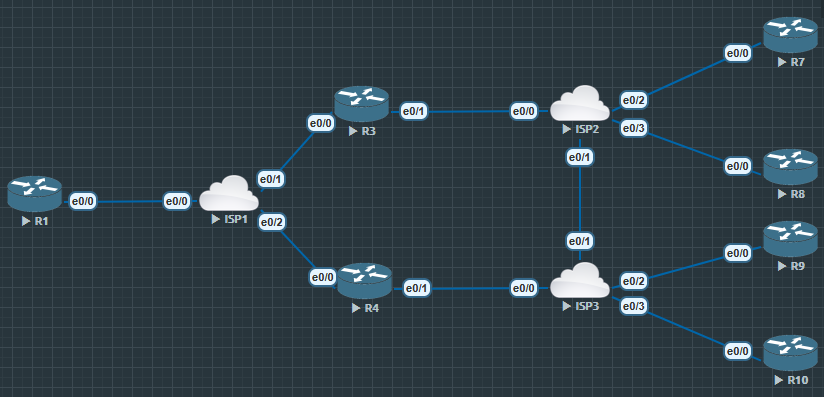
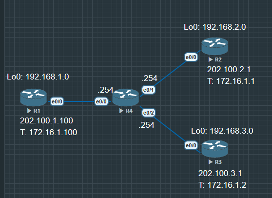
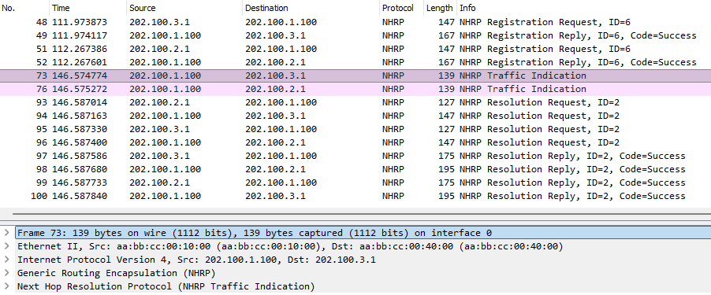

# DMVPN 三个阶段

1. 第一个阶段-星形拓扑设计(Hub to Spoke Designs) 仅可实现分支站点间的通信, 只有 Hub 是 mGRE 隧道, 是全 GRE 隧道连接到中心站点, 中心站点流量负担重

2. 第二个阶段-虚拟网状拓扑设计 (Spoketo Spoke Designs) 所有站点都配置了 mGRE 隧道, 分支站点之间有流量触发建立动态隧道, 只有分支站点到中心站点建立着永恒隧道, 阶段二不支持中心站点的路由汇总

3. 第三个阶段-层次化(树状)拓扑设计(Hierarchical[Tree-Based]Designs) 解决了阶段二不支持路由的汇总的问题, 能够实现不同区域的分支站点直接建立隧道.

|星形拓扑|虚拟网状拓扑|层次化设计|
|:--:|:--:|:--:|
|简化的中心站点和分支站点配置, 中心站点为mGRE隧道, 分支站点为点对点GRE隧道|全站点mGRE隧道|增加了一个中心站点能够承载的分支站点数量|
|支持分支站点动态地址|分支站点间直接建立, 减轻中心站点负载|层次化树状构架, 不需要区域中心站点间网状连接|
|由于分支站点都是点对点GRE隧道, 所以支持分支站点到中心站点的组播|不支持到中心站点的路由汇总|分支站点不需要完整的路由表, 支持到中心站点的路由汇总|
|支持到中心站点的路由汇总|去往某分支站点内部网络的路由, 下一跳必须是该分支站点的虚拟隧道接口地址|不支持在一个DMVPN云重同时出现第二和第三阶段配置|

<center>  </center>

*PS: 在考试中如果没有明确要求配置 DMVPN 第三阶段就不要去配, 要求配置再去配*

## 配置



在之前的[DMVPN的路由协议](DMVPN的路由协议.md)中, 提到 OSPF 不能像其他动态路由协议一样解决中心站点负载过大的问题. 现在把 DMVPN 中的路由协议配置为 OSPF

```
R1#show ip os neighbor

Neighbor ID     Pri   State           Dead Time   Address         Interface
3.3.3.3           0   FULL/  -        00:01:50    172.16.1.2      Tunnel0
2.2.2.2           0   FULL/  -        00:01:53    172.16.1.1      Tunnel0

R3#show ip route os

......

      172.16.0.0/16 is variably subnetted, 4 subnets, 2 masks
O        172.16.1.1/32 [110/2000] via 172.16.1.100, 00:07:36, Tunnel0
O        172.16.1.100/32 [110/1000] via 172.16.1.100, 00:07:36, Tunnel0
      192.168.1.0/32 is subnetted, 1 subnets
O        192.168.1.1 [110/1001] via 172.16.1.100, 00:07:36, Tunnel0
      192.168.2.0/32 is subnetted, 1 subnets
O        192.168.2.1 [110/2001] via 172.16.1.100, 00:07:36, Tunnel0
```

OSPF 所有路由下一跳都来自中心站点

**现在需要在 Hub 配置一条命令, Spoke 配置一条命令, 阶段三结束**

R1

```
R1(config)#int tunnel 0
R1(config-if)#ip nhrp redirect //启用 NHRP 重定向流量标识

R1#show run interface tunnel 0
Building configuration...

Current configuration : 282 bytes
!
interface Tunnel0
 ip address 172.16.1.100 255.255.255.0
 no ip redirects
 ip nhrp authentication cisco
 ip nhrp network-id 10
 ip nhrp redirect //重定向开启
 ip ospf network point-to-multipoint
 ip ospf 110 area 0
 tunnel source Ethernet0/0
 tunnel mode gre multipoint
 tunnel key 12345
end
```

R2, R3 镜像配置

```
R2(config)#int tunnel 0
R2(config-if)#ip nhrp shortcut //收到中心站点的 NHRP 重定向报文就修改下一跳
```



现在已经能看到中心站点发送的报文要求分支站点修改下一跳

```
R3#show ip route os
Codes: L - local, C - connected, S - static, R - RIP, M - mobile, B - BGP
       D - EIGRP, EX - EIGRP external, O - OSPF, IA - OSPF inter area
       N1 - OSPF NSSA external type 1, N2 - OSPF NSSA external type 2
       E1 - OSPF external type 1, E2 - OSPF external type 2
       i - IS-IS, su - IS-IS summary, L1 - IS-IS level-1, L2 - IS-IS level-2
       ia - IS-IS inter area, * - candidate default, U - per-user static route
       o - ODR, P - periodic downloaded static route, H - NHRP, l - LISP
       a - application route
       + - replicated route, % - next hop override, p - overrides from PfR

Gateway of last resort is 202.100.3.254 to network 0.0.0.0

      172.16.0.0/16 is variably subnetted, 4 subnets, 2 masks
O   %    172.16.1.1/32 [110/2000] via 172.16.1.100, 00:23:32, Tunnel0
O        172.16.1.100/32 [110/1000] via 172.16.1.100, 00:23:32, Tunnel0
O     192.168.1.0/24 [110/1001] via 172.16.1.100, 00:00:09, Tunnel0
O   % 192.168.2.0/24 [110/2001] via 172.16.1.100, 00:00:19, Tunnel0
```

并且看到路由表里 R2 的路由前面有个 "%" 代表下一跳被改写, 详细情况可以使用命令 `show ip cef` 或者精确查看 `show ip cef X.X.X.X`中查看

```
R3#show ip cef 192.168.2.0
192.168.2.0/24
  nexthop 172.16.1.1 Tunnel0
```

*PS: 如果实验中环回接口没有被改写, 进入环回接口配置命令 `ip ospf network point-to-multipoint' (镜像配置) 要求以正常接口通告给其他邻居*

## 路由汇总

将拓扑配置为 EIGRP

```
R1#show ip route ei

......

D     192.168.2.0/24 [90/27008000] via 172.16.1.1, 00:01:37, Tunnel0
D     192.168.3.0/24 [90/27008000] via 172.16.1.2, 00:01:04, Tunnel0
```

```
R2#show ip route eigrp

......

Gateway of last resort is 202.100.2.254 to network 0.0.0.0

D     192.168.1.0/24 [90/27008000] via 172.16.1.100, 00:04:01, Tunnel0
```

中心站点拥有所有分支站点的路由, 但是分支站点只有中心站点的路由, 之前学习到的方法是在中心站点的隧道中, 取消掉水平分割.

现在可以在隧道接口手动将路由汇总

```
R1(config)#int tunnel 0
R1(config-if)#ip summary-address eigrp 90 192.168.0.0 255.255.0.0
```

现在各个分支站点就拥有了一条汇总路由

```
R2#show ip route eigrp

......

D     192.168.0.0/16 [90/27008000] via 172.16.1.100, 00:00:35, Tunnel0
```

```
R2#traceroute 192.168.3.1 source lo0
Type escape sequence to abort.
Tracing the route to 192.168.3.1
VRF info: (vrf in name/id, vrf out name/id)
  1 172.16.1.100 0 msec 1 msec 0 msec
  2 172.16.1.2 5 msec 0 msec *

R2#traceroute 192.168.3.1 source lo0
Type escape sequence to abort.
Tracing the route to 192.168.3.1
VRF info: (vrf in name/id, vrf out name/id)
  1 172.16.1.2 1 msec 0 msec *
```

同样因为开启了定向, 流量第一次触发的时候, 中心站点就会通知分支站点新的下一跳, 从而不再需要去关闭水平分割和下一跳自我

```
R2#show ip nhrp
172.16.1.1/32 via 172.16.1.1
   Tunnel0 created 00:05:49, expire 00:04:10
   Type: dynamic, Flags: router unique local
   NBMA address: 202.100.2.1
    (no-socket)
172.16.1.2/32 via 172.16.1.2
   Tunnel0 created 00:05:49, expire 00:04:10
   Type: dynamic, Flags: router nhop rib
   NBMA address: 202.100.3.1
172.16.1.100/32 via 172.16.1.100
   Tunnel0 created 00:16:30, never expire
   Type: static, Flags: used
   NBMA address: 202.100.1.100
192.168.2.0/24 via 172.16.1.1
   Tunnel0 created 00:05:21, expire 00:04:38
   Type: dynamic, Flags: router unique local
   NBMA address: 202.100.2.1
    (no-socket)
192.168.3.0/24 via 172.16.1.2
   Tunnel0 created 00:05:49, expire 00:04:10
   Type: dynamic, Flags: router used rib
   NBMA address: 202.100.3.1
```

在 ip nhrp 里也表明了真实下一跳具体地址