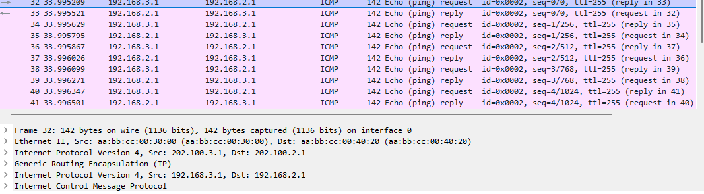
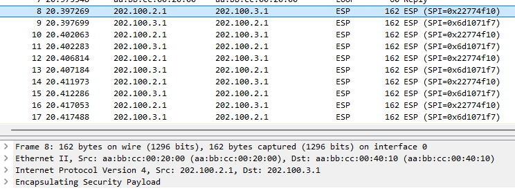

归根到底我们讲的是 IPSec, 现在mGRE 和 NHRP 建立好了, 但是各个邻居之间报文还是明文




## 阶段1

```
R1(config)#crypto isakmp policy 10
R1(config-isakmp)#authentication pre-share
R1(config-isakmp)#encryption 3des
R1(config-isakmp)#hash md5
R1(config-isakmp)#group 2

R1(config)#crypto isakmp key acc address 0.0.0.0 // 因为分支站点公网 IP 不固定
```

## 阶段2

```
R1(config)#crypto ipsec transform-set TRANS0 esp-3des
R1(cfg-crypto-trans)#mode transport

R1(config)#crypto ipsec profile DMVPN0
R1(ipsec-profile)#set transform-set TRANS0
```

## 调用

```
R1(config)#int tunnel 0 
R1(config-if)#tunnel protection ipsec profile DMVPN0
R1(config-if)#ip mtu 1400 // 生产环境中还是要限制一下每个包大小
```

全镜像配置



结束