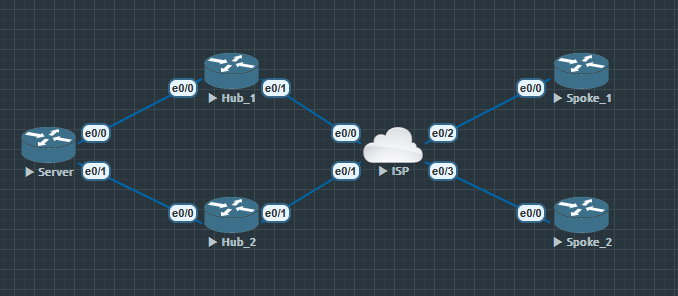
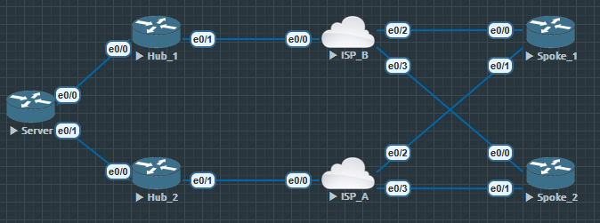

# 单云双中心



单云标识只有一个网络隧道, 每个分支站点都与两个中心站点建立永久隧道连接, 两个中心站点建立动态路由协议的邻居关系. 

分支站点会从两个中心站点学习到中心内部网络, 当分支站点方位内部网络时
    
    1. 可以实现负载均衡

    2. 其中一个中心站点出现问题, 另一个能接管所有流量

以此提高 DMVPN 的可用性

## 配置

中心站点

```
Hub1(config)#crypto isakmp policy 10
Hub1(config-isakmp)#authentication pre-share

Hub1(config)#crypto isakmp key cisco address 0.0.0.0
Hub1(config)#crypto isakmp keepalive 10 periodic

Hub1(config)#crypto ipsec transform-set cisco esp-des esp-md5-hmac
Hub1(cfg-crypto-trans)#mode transport

Hub1(config)#crypto ipsec profile dmvpn-profile
Hub1(ipsec-profile)#set transform-set cisco

Hub1(config)#int tunnel 0
Hub1(config-if)#bandwidth 1000
Hub1(config-if)#ip add 172.16.1.100 255.255.255.0
Hub1(config-if)#no ip redirects
Hub1(config-if)#ip mtu 1400
Hub1(config-if)#ip nhrp map multicast dynamic
Hub1(config-if)#ip nhrp network-id 10
Hub1(config-if)#ip nhrp holdtime 360
Hub1(config-if)#ip tcp adjust-mss 1360
Hub1(config-if)#ip ospf network broadcast
Hub1(config-if)#ip ospf cost 100
Hub1(config-if)#ip ospf priority 2
Hub1(config-if)#delay 1000
Hub1(config-if)#tunnel source e0/1
Hub1(config-if)#tunnel mode gre multipoint
Hub1(config-if)#tunnel key 12345
Hub1(config-if)#tunnel protection ipsec profile dmvpn-profile

Hub1(config)#int e0/1
Hub1(config-if)#ip add 202.100.1.100 255.255.255.0
Hub1(config-if)#no shu

Hub1(config)#int e0/0
Hub1(config-if)#ip add 192.168.100.100 255.255.255.0
Hub1(config-if)#no shu

Hub1(config)#router ospf 1
Hub1(config-router)#log-adjacency-changes
Hub1(config-router)#network 172.16.1.0 0.0.0.255 area 0
Hub1(config-router)#network 192.168.0.0 0.0.255.255 area 0

```


# 双云双中心



双云标识有两条隧道网络, 这种双云双中 DMVPN 中, 每一个分支站点都需要配置两个 mGRE 速递到接口, 每个隧道都要配置一个 NHRP 服务器. 

分支站点需要同时和两个隧道口的两个中心站点建立永久隧道和路由协议的邻居关系.

与单云中心一样, 分支站点能够通过两个中心站点学习到路由, 双中心也能实现负载均衡与备份

**相对于单云双中心, 双云双中心结构与配置都更负载**