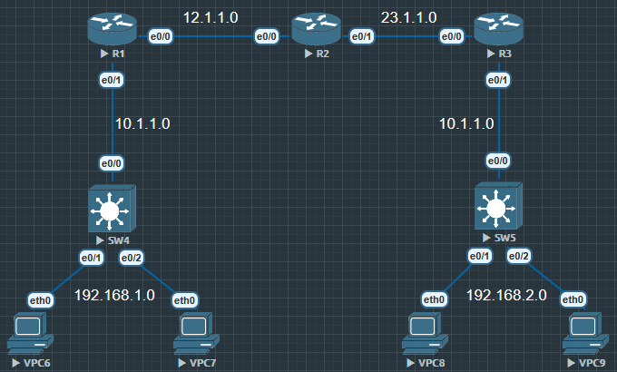

镜像配置

```
R1(config)#router ospf 110
R1(config-router)#redistribute static subnets

R1(config)#int tunnel 0
R1(config-if)#tunnel source 202.100.1.1
R1(config-if)#tunnel destination 61.128.1.2
R1(config-if)#ip add 12.1.1.1 255.255.255.0
R1(config-if)#ip ospf 110 area 0
R1(config-if)#ip mtu 1400

R1(config)#crypto isakmp policy 10
R1(config-isakmp)#authentication pre-share
R1(config-isakmp)#encryption aes
R1(config-isakmp)#group 5
R1(config-isakmp)#hash sha
R1(config-isakmp)#lifetime 3600

R1(config)#crypto isakmp key acc address 0.0.0.0 //全邻居加密

R1(config)#crypto ipsec transform-set TRANS0 ah-md5-hmac
R1(cfg-crypto-trans)#mode transport

R1(config)#crypto ipsec profile CRYPTOPROFILE
R1(ipsec-profile)#set transform-set TRANS0

R1(config)#int tunnel 0
R1(config-if)#tunnel protection ipsec profile CRYPTOPROFILE
```

结束, 省却了感兴趣流, crypto map 的设置, 因为在隧道里调用了 protection 所以所有进入隧道的流量都是感兴趣流, peer 就是隧道对端

PS: 也可以一端用 protection 模式, 一端用传统模式