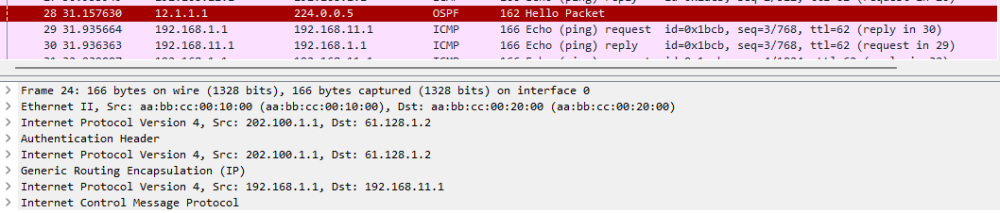
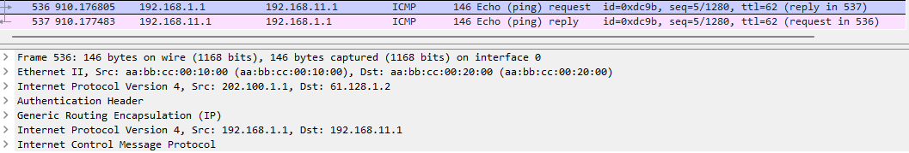

在此拓扑中模拟了一个生产环境, R1 与 R2 的 e0/1 均为 `ip nat inside` e0/0 均为 `ip nat outside`

`access list 1 permit 192.168.1.0 0.0.0.255`

`access list 1 permit 192.168.2.0 0.0.0.255`

`ip nat inside source list 1 interface e0/0 overload`

因为在 R1 与 R3 配置了 NAT, 这个时候如果设置了 IPSec 的感兴趣流是 192.168.1.0 - 192.168.2.0 就会失效, 因为在 CISCO 设备的逻辑中, NAT 的优先级是高于 IPSec 的

这个时候就需要一个技术 **NAT 排除**

# NAT 排除

对 IPSec 的流量不进行转换, 就不能再使用标准控制列表而是要是用扩展(镜像配置)

```
R1(config)#no ip access-list standard NAT

R1(config)#ip access-list extended NAT
R1(config-ext-nacl)#deny ip 192.168.1.0 0.0.0.255 192.168.11.0 0.0.0.255
R1(config-ext-nacl)#permit ip 192.168.1.0 0.0.0.255 any
```

针对要加密的对象不要进行 NAT 转换. 之后如常配置 IPSec (镜像)

```
R1(config)#crypto isakmp policy 10
R1(config-isakmp)#authentication pre-share
R1(config-isakmp)#encryption aes
R1(config-isakmp)#group 5
R1(config-isakmp)#lifetime 3600
R1(config-isakmp)#hash sha

R1(config)#crypto ipsec transform-set TRANS0 esp-aes esp-md5-hmac

R1(config)#ip access-list extended S2S
R1(config-ext-nacl)#permit ip 192.168.1.0 0.0.0.255 192.168.11.0 0.0.0.255

R1(config)#crypto map SITE 10 ipsec-isakmp
% NOTE: This new crypto map will remain disabled until a peer
        and a valid access list have been configured.
R1(config-crypto-map)#set transform-set TRANS0
R1(config-crypto-map)#set peer 61.128.1.2
R1(config-crypto-map)#match address S2S

R1(config)#int e0/0
R1(config-if)#crypto map SITE
```

## GRE

站点到站点是经典的 IPSec 任何设备都能配置, 但是不能兼容动态路由协议

用 GRE over IPSec 可以避免感兴趣流频繁增删 

### 配置 

先还原拓扑, 取消关于 crypto, nat 的设置

镜像设置 GRE 隧道

```
R1(config)#int tunnel 0
R1(config-if)#tunnel mode gre ip
R1(config-if)#tunnel source 202.100.1.1
R1(config-if)#tunnel destination 61.128.1.2
R1(config-if)#ip address 12.1.1.1 255.255.255.0
```

建立 OSPF, 重分布静态路由 (镜像配置)

```
R1(config)#int tunnel 0
R1(config-if)#ip ospf 110 area 0

R1(config)#int e0/1
R1(config-if)#ip ospf 110 area 0

R1(config)#router ospf 110
R1(config-router)#redistribute static subnets
```

如果想要精确控制也是使用 route-map

```
R3(config)#ip prefix-list TUN seq 10 permit 192.168.11.0/24

R3(config)#route-map REDIS permit 10
R3(config-route-map)#match ip address prefix-list TUN

R3(config-router)#redistribute static route-map REDIS subnets
```

同样镜像配置加密 这里transform-set 使用ah-md5-hmac 是为了方便抓包看头部

```
R1(config)#ip access-list extended GRE
R1(config-ext-nacl)#permit gre 202.100.1.1 0.0.0.0 61.128.1.2 0.0.0.0

R1(config)#crypto isakmp policy 10
R1(config-isakmp)#authentication pre-share
R1(config-isakmp)#encryption aes
R1(config-isakmp)#group 5
R1(config-isakmp)#hash sha
R1(config-isakmp)#lifetime 3600

R1(config)#crypto isakmp key acc address 61.128.1.2

R1(config)#crypto ipsec transform-set TRANS0 ah-md5-hmac

R1(config)#crypto map SITE 10 ipsec-isakmp

R1(config-crypto-map)#set peer 61.128.1.2
R1(config-crypto-map)#set transform-set TRANS0
R1(config-crypto-map)#mat address GRE

R1(config)#int e0/0
R1(config-if)#crypto map SITE
```



因为之前没有把 transform-set 的模式从 tunnel 改为 transport 所有抓包看到有三层头部, 这是比较浪费的. 如果 ACL 写为 permit  gre any any 能通, 但也会有三层头部



镜像配置

```
R1(config)#crypto ipsec transform-set TRANS0 ah-md5-hmac
R1(cfg-crypto-trans)#mode transport

R1#clear crypto session // 重新协商
```


可以看到一阶段的6个包, 二阶段的3个包

一个包出去头部有1500个字节, 但是 IPSec 封装会占据68个字节, 建议把隧道 IP mtu 设置为 1400, 因为头部的占据更大, 所以发不出1500字节的标准包

镜像配置

```
R1(config)#int tunnel 0
R1(config-if)#ip mtu 1400
```

以上为最经典的 IPSec 配置, 缺点是命令较多. [第二种 IPSec 配置方式](GRE_Over_IPSec_2.md)

第二种方式更为简单