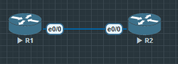
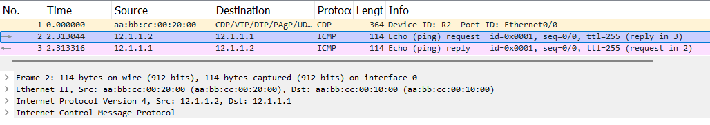

IKE 阶段一

在阶段一现在普遍使用 主模式 main mode, 很少使用 AggressiveMode

IKE 阶段二

QuickMode

IKE 协议模式 

MainMode 主模式

QuickMode 快速模式

AggressiveMode (主要用在动态拨号获取 IP 的站点情况下使用)

在 IPSec VPN 配置完毕后抓包会显示有9个包或6给包

Qick mode 在阶段二会有3个包, Main mode 在阶段一会有6个包, Aggressive Mode 在阶段一有3个包

在阶段一

1. 双方会互相检查对方IP地址是否正确

2. 协商 IKE 策略, 哪个 policy 双方都能接受

## Main Mode

主模式一共要交换6个 ISAKMP 数据包, 这个过程分为 1-2, 3-4, 5-6 三次

`encrypto isakmp key xxx address x.x.x.x` 设置 pre shared 密钥

### 1-2包

1. 核对收到的 ISAKMP 数据包的源 IP 地址, 来确认收到的 ISAKMP 数据包是否源自合法的对等体.

2. 协商 IKE 策略

------------------



在没有任何加密得情况下 R1 R2 互 ping, 抓包可以看到是全明文




Cisco 路由器有默认的加密策略, 一般不用默认策略


```
R1#show crypto isakmp policy

Default IKE policy
Protection suite of priority 65507
        encryption algorithm:   AES - Advanced Encryption Standard (128 bit keys).
        hash algorithm:         Secure Hash Standard
        authentication method:  Rivest-Shamir-Adleman Signature
        Diffie-Hellman group:   #5 (1536 bit)
        lifetime:               86400 seconds, no volume limit
Protection suite of priority 65508
        encryption algorithm:   AES - Advanced Encryption Standard (128 bit keys).
        hash algorithm:         Secure Hash Standard
        authentication method:  Pre-Shared Key
        Diffie-Hellman group:   #5 (1536 bit)
        lifetime:               86400 seconds, no volume limit
Protection suite of priority 65509
        encryption algorithm:   AES - Advanced Encryption Standard (128 bit keys).
        hash algorithm:         Message Digest 5
        authentication method:  Rivest-Shamir-Adleman Signature
        Diffie-Hellman group:   #5 (1536 bit)
        lifetime:               86400 seconds, no volume limit
Protection suite of priority 65510
        encryption algorithm:   AES - Advanced Encryption Standard (128 bit keys).
        hash algorithm:         Message Digest 5
```

配置策略(*必须镜像配置*)

```
R1(config)#crypto isakmp policy 10
R1(config-isakmp)#encryption aes
R1(config-isakmp)#hash sha
R1(config-isakmp)#authentication pre-share
R1(config-isakmp)#group 5
R1(config-isakmp)#lifetime 3600
```

为了杜绝中间人攻击, 还要设置好pre share key 和邻居地址(*镜像*)

`R1(config)#crypto isakmp key ccielab address 12.1.1.2`

9