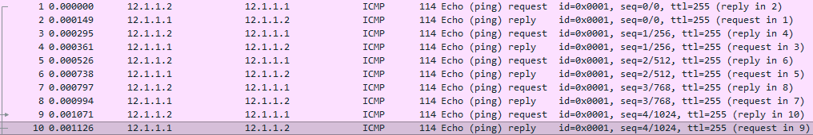
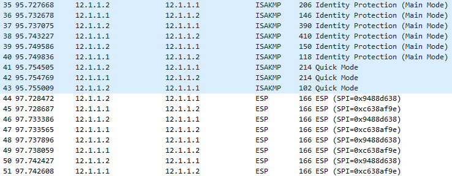

阶段1 定义了 isakmp 策略, 阶段2 定义 ipsec

ah 只做完整性校验

esp-sha-hmac 数据加密-完整性校验-源认证

`R1(config)#crypto ipsec transform-set TRANS0 esp-3des  esp-md5-hmac`

`R1(config)#crypto ipsec transform-set [WORD] [MODE 可以多个]`

镜像配置后, 就需要定义感兴趣流(SPD), 告诉路由器哪些流量需要加密

使用 ACL 来匹配SPD

```
R1(config)#ip access-list extended R1_R2
R1(config-ext-nacl)#permit ip 12.1.1.1 0.0.0.0 12.1.1.2 0.0.0.0
```

```
R2(config)#ip access-list extended R2_R1
R2(config-ext-nacl)#permit ip 12.1.1.2 0.0.0.0 12.1.1.1 0.0.0.0
```
配置加密策略 crypto map 镜像配置

```
R1(config)#crypto map SITE2SITE1 10 ipsec-isakmp
% NOTE: This new crypto map will remain disabled until a peer
        and a valid access list have been configured.
R1(config-crypto-map)#set peer 12.1.1.2
R1(config-crypto-map)#match address R1_R2
R1(config-crypto-map)#set transform-set TRANS0
```

验证

```
R1#show crypto map
        Interfaces using crypto map NiStTeSt1:

Crypto Map IPv4 "SITE2SITE1" 10 ipsec-isakmp
        Peer = 12.1.1.2
        Extended IP access list R1_R2
            access-list R1_R2 permit ip host 12.1.1.1 host 12.1.1.2
        Security association lifetime: 4608000 kilobytes/3600 seconds
        Responder-Only (Y/N): N
        PFS (Y/N): N
        Mixed-mode : Disabled
        Transform sets={
                TRANS0:  { esp-3des esp-md5-hmac  } ,
        }
        Interfaces using crypto map SITE2SITE1:
```

最后在接口上调用

```
R1(config)#int e0/0
R1(config-if)#crypto map SITE2SITE1
```





现在加密后抓包可以看到数据已经加密

```
R2#show crypto ipsec transform-set
Transform set default: { esp-aes esp-sha-hmac  }
   will negotiate = { Transport,  },

Transform set S2S1: { esp-3des esp-md5-hmac  }
   will negotiate = { Tunnel,  },
```

ipsec 默认是 tunnel 模式

```
R1(config)#crypto ipsec transform-set S2S1 esp-3des esp-md5-hmac
R1(cfg-crypto-trans)#mode ?
  transport  transport (payload encapsulation) mode
  tunnel     tunnel (datagram encapsulation) mode

R1(cfg-crypto-trans)#mode transport
```

通讯点和加密点不在一台设备上必须用 tunnel 模式

通讯点和加密点都在一台设备上可以用 transport 模式(节约25字节的头部)