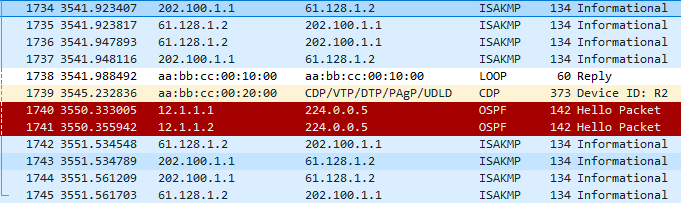

# DPD

1. 周期性的 DPD: 周期性的发送 DPD 报文去检测 IPSec 的状态, 好处是快, 缺点报文过多

2. 按需 DPD (默认模式): 一端发送加密的数据. 对端回复加密数据, 但是对端没有回复就会发送 DPD 检测报文. 好处是报文烧, 缺点慢

`R1(config)#crypto isakmp keepalive 10 periodic` 周期性每10秒发送一个 DPD 报文



在 Time 类目可以看到每隔10秒有报文往来, 如果现在把 R3 的 e0/0 shutdown

`R1(config)#crypto isakmp keepalive 10` 按需模式, 如果一个 isakmp 没有回复 10秒后断开安全关联

`show crypto engine connections active` 查看安全关联

```
*Jun 21 09:20:25.799: %LINEPROTO-5-UPDOWN: Line protocol on Interface Tunnel0, changed state to down


R1#show crypto engine connections active
Crypto Engine Connections

   ID  Type    Algorithm           Encrypt  Decrypt LastSeqN IP-Address

```

安全关联被清空了

# RRI

# 链路备份的 IPSec VPN

# 设备备份的 IPSec VPN

# 双 SVTI 的 IPSec VPN