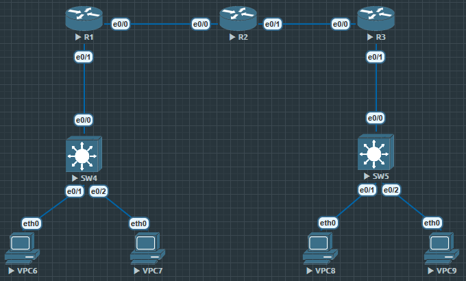

对于 Site to Site 最重要的一个问题是路由, VPC6 要访问 VPC8, 但是 R1 只有直连 SW 方向和 R2, 不知道 VPC8 在哪

通信点是 VPC 加密点是 R1 和 R3

站点到站点加密最重要的是路由, 站点双方都需要:

1. 远端通信点

2. 远端解密点

```
R3#show crypto ipsec transform-set TRANS0
{ esp-aes esp-md5-hmac  }
   will negotiate = { Tunnel,  },
```

如果通信点与解密点不在同一设备上必须使用 tunnel.

```
R3(config)#crypto ipsec transform-set TRANS0 esp-aes esp-md5-hmac
R3(cfg-crypto-trans)#mode ?
  transport  transport (payload encapsulation) mode
  tunnel     tunnel (datagram encapsulation) mode
```

可以在 transform-set 里修改
