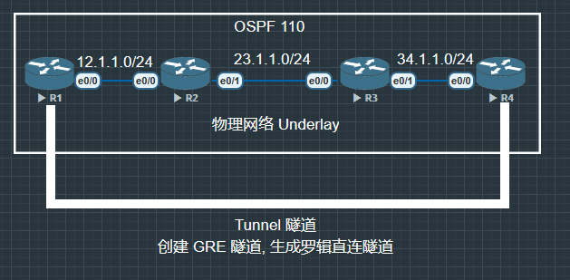

cisco ipsec vpn 实战指南

VPN Virtual Private Network

利用廉价接入的公共网络来传输私有数据, 相较传统专线连网方式具有成本优势

VPN 的两种连接方式

1. site to site

    1. GRE generic routing encapsulation

    2. IPSec VPN

    3. MPLS VPN

2. remote access

## GRE

Cisco 开发的轻量级隧道协议, 但是 GRE 没有任何安全防护机制.



```
R1(config)#int tunnel 0
R1(config-if)#tunnel mode gre ip
R1(config-if)#ip add 14.1.1.1 255.255.255.0
R1(config-if)#no shu
R1(config-if)#tunnel source 12.1.1.1 //指定源
R1(config-if)#tunnel destination 34.1.1.4 //指定目的
```

R4 镜像配置

```
R4(config)#int tunnel 0
R4(config-if)#tunnel mode gre ip
R4(config-if)#ip address 14.1.1.4 255.255.255.0
R4(config-if)#no shu
R4(config-if)#tunnel source 34.1.1.4
R4(config-if)#tunnel destination 12.1.1.1
```

既然 tunnel 是逻辑链路, 所以 tunnel 之间也是可以跑路由协议的


R1/R4 镜像配置

```
R1(config)#router os 111
R1(config-router)#router-id 14.1.1.1

R1(config)#int tunnel 0
R1(config-if)#ip o 110 a 0
```

```
R1#show ip os neighbor

Neighbor ID     Pri   State           Dead Time   Address         Interface
14.1.1.4          0   FULL/  -        00:00:39    14.1.1.4        Tunnel0
2.2.2.2           1   FULL/DR         00:00:39    12.1.1.2        Ethernet0/0
```

任何 VPN 本质就是把一个数据包通过某周技术再封装到另一个数据包来实现.

