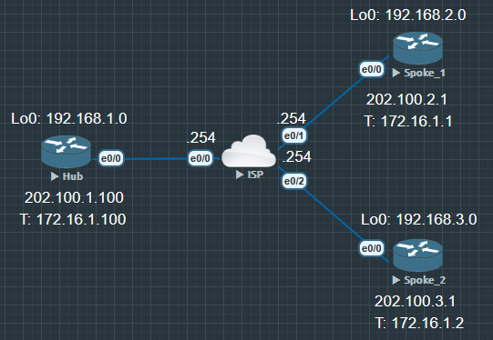

Front VRF

1. 路由隔离, 将不同前置网络流量隔离, SD-WAN 中有更复杂的设计-业务路由与传输策略路由分割

2. 流量引导

3. 安全控制

4. 增强流量管理和灵活性

与 FVRF 相对的是 IVRF-Inside VRF

总的来说 FVRF 就是将广域网接口划分到一个 VRF 中, 实现传输和业务隔离



## FVRF 配置

第一步需要给 Hub, Spoke1, Spoke2 都各设置一个 VRF, 并把公网 IP 绑定到 VRF 中

Hub, Spoke1, Spoke2 镜像配置

```
Hub(config)#ip vrf FVRF

Hub(config)#do show run int e0/0
Building configuration...

Current configuration : 82 bytes
!
interface Ethernet0/0
 ip address 202.100.1.100 255.255.255.0
 duplex auto
end //当接口绑定 VRF 后, 之前的配置会消失.

Hub(config)#int e0/0
Hub(config-if)#ip vrf forwarding FVRF
Hub(config-if)#ip address 202.100.1.100 255.255.255.0
// 现在动态路由, crypto, DMVPN, 默认路由 全都断了, 因为之前这些配置是到端口, 而不是配置到 VRF

Hub(config)#ip route vrf FVRF 0.0.0.0 0.0.0.0 202.100.1.254

Hub(config-if)#int tunnel 0
Hub(config-if)#tunnel vrf FVRF
//将隧道绑定到设置好的 VRF 上, 之后就能看到动态路由, DMVPN ...通了
```

现在已经初步隔离开了全局和隧道的流量

```
Hub#show ip route vrf FVRF

......

S*    0.0.0.0/0 [1/0] via 202.100.1.254
      202.100.1.0/24 is variably subnetted, 2 subnets, 2 masks
C        202.100.1.0/24 is directly connected, Ethernet0/0
L        202.100.1.100/32 is directly connected, Ethernet0/0
```

全局只有一条默认路由, 隧道(业务侧的路由一条都没有)

```
Hub#show ip route

......

      172.16.0.0/16 is variably subnetted, 2 subnets, 2 masks
C        172.16.1.0/24 is directly connected, Tunnel0
L        172.16.1.100/32 is directly connected, Tunnel0
      192.168.1.0/24 is variably subnetted, 2 subnets, 2 masks
C        192.168.1.0/24 is directly connected, Loopback0
L        192.168.1.1/32 is directly connected, Loopback0
D     192.168.2.0/24 [90/27008000] via 172.16.1.1, 00:03:36, Tunnel0
D     192.168.3.0/24 [90/27008000] via 172.16.1.2, 00:03:48, Tunnel0
```

## crypto 镜像配置

```
Hub(config)#crypto isakmp policy 10
Hub(config-isakmp)#authentication pre
Hub(config-isakmp)#encryption 3des
Hub(config-isakmp)#hash md5
Hub(config-isakmp)#group 2

Hub(config)#crypto isakmp key acc address 0.0.0.0

Hub(config)#crypto ipsec transform-set TRANS0 esp-3des
Hub(cfg-crypto-trans)#mode transport

Hub(config)#crypto ipsec profile IPSEC0
Hub(ipsec-profile)#set transform-set TRANS0

Hub(config)#int tunnel 0
Hub(config-if)#tunnel protection ipsec profile IPSEC0
```

```
Hub#show crypto session
Crypto session current status

Interface: Tunnel0
Session status: DOWN
Peer: 202.100.3.1 port 500
  IPSEC FLOW: permit 47 host 202.100.1.100 host 202.100.3.1
        Active SAs: 0, origin: crypto map

Interface: Tunnel0
Session status: DOWN
Peer: 202.100.2.1 port 500
  IPSEC FLOW: permit 47 host 202.100.1.100 host 202.100.2.1
        Active SAs: 0, origin: crypto map

Hub#show ip eigrp neighbors
EIGRP-IPv4 Neighbors for AS(90)
```

加密是状态是 DOWN, EIGRP 邻居也没有起来. 问题就在 `crypto isakmp key` 上, 这样配置只会把密钥配置路由器上, 并没有配置在 VRF 上, 这里要使用[阶段一密钥公钥共享的第二种方式](IPSec_阶段一密钥公钥共享的第二种方式.md)来配置密钥


```
Hub(config)#crypto keyring PASD0 vrf FVRF
Hub(conf-keyring)#pre-shared-key address 0.0.0.0 key acc
```
### 验证

```
Hub#show crypto session
Crypto session current status

Interface: Tunnel0
Session status: UP-ACTIVE
Peer: 202.100.3.1 port 500
  Session ID: 0
  IKEv1 SA: local 202.100.1.100/500 remote 202.100.3.1/500 Active
  IPSEC FLOW: permit 47 host 202.100.1.100 host 202.100.3.1
        Active SAs: 2, origin: crypto map

Interface: Tunnel0
Session status: UP-ACTIVE
Peer: 202.100.2.1 port 500
  Session ID: 0
  IKEv1 SA: local 202.100.1.100/500 remote 202.100.2.1/500 Active
  IPSEC FLOW: permit 47 host 202.100.1.100 host 202.100.2.1
        Active SAs: 2, origin: crypto map

Hub#show ip eigrp neighbors
EIGRP-IPv4 Neighbors for AS(90)
H   Address                 Interface              Hold Uptime   SRTT   RTO  Q  Seq
                                                   (sec)         (ms)       Cnt Num
1   172.16.1.2              Tu0                      12 00:00:23   24  1398  0  11
0   172.16.1.1              Tu0                      11 00:00:52   15  1398  0  12
```