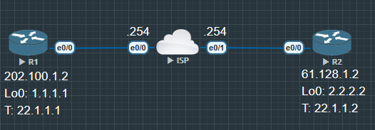

镜像配置

```
R1(config)#int tunnel 0
R1(config-if)#tunnel source 202.100.1.2
R1(config-if)#tunnel destination 61.128.1.2
```

配置 EIGRP 邻居

```
R1(config)#router ei 90
R1(config-router)#network 22.1.1.1 0.0.0.0
R1(config-router)#network 1.1.1.1 0.0.0.0

R1#show ip route ei

......

      2.0.0.0/32 is subnetted, 1 subnets
D        2.2.2.2 [90/27008000] via 22.1.1.2, 00:00:06, Tunnel0
```

现在 R1 和 R2 从隧道能学到各自的环回接口

如果把各自的 e0/0 宣告进 EIGRP 就会很奇怪

1. 路由器通过 EIGRP 邻居学习到了他的公网 IP

2. 因为有了明细路由, 路由器就会用明细路由去建立隧道, 而不是用之前的默认静态路由

3. 又由于之前建立隧道用的是 0.0.0.0 这个默认路由, 现在不用这条路由隧道就会断

4. 隧道断了以后, EIGRP 邻居关系也会断, 明细路由就传不过来

5. 明细路由传不过来, 默认路由又会被启用, 启用后就又能建立 EIGRP 邻居

6. 然后又断, 又建, 如此反复形成震荡

```
*Jun 28 14:37:24.182: %LINEPROTO-5-UPDOWN: Line protocol on Interface Tunnel0, changed state to up
*Jun 28 14:37:24.550: %DUAL-5-NBRCHANGE: EIGRP-IPv4 90: Neighbor 22.1.1.1 (Tunnel0) is up: new adjacency
*Jun 28 14:37:24.870: %ADJ-5-PARENT: Midchain parent maintenance for IP midchain out of Tunnel0 - looped chain attempting to stack


*Jun 28 14:37:34.183: %TUN-5-RECURDOWN: Tunnel0 temporarily disabled due to recursive routing
*Jun 28 14:37:34.183: %LINEPROTO-5-UPDOWN: Line protocol on Interface Tunnel0, changed state to down
*Jun 28 14:37:34.183: %DUAL-5-NBRCHANGE: EIGRP-IPv4 90: Neighbor 22.1.1.1 (Tunnel0) is down: interface down

*Jun 28 14:38:34.231: %LINEPROTO-5-UPDOWN: Line protocol on Interface Tunnel0, changed state to up
R2#
*Jun 28 14:38:35.511: %DUAL-5-NBRCHANGE: EIGRP-IPv4 90: Neighbor 22.1.1.1 (Tunnel0) is up: new adjacency
R2#
*Jun 28 14:38:50.795: %DUAL-5-NBRCHANGE: EIGRP-IPv4 90: Neighbor 22.1.1.1 (Tunnel0) is down: holding time expired
```

