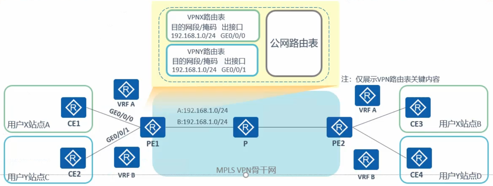
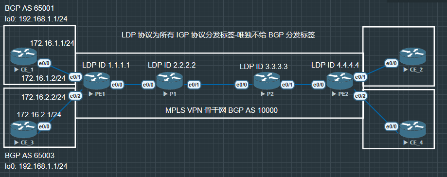

# VRF

- VRF(Virtual Routing and Forwarding, 虚拟路由转发), 又称 VPN 实例, **是 MPLS VPN 架构中的关键技术, 每个 VPN 实例使用独立的路由转发表项, 实现 VPN 之间的逻辑隔离.**



## 配置



```
PE1(config)#ip vrf VPNA

PE1(config)#ip vrf VPNB
```

使用命令 `show ip vr` 可以查看设备上已创立的 VRF, 现在 VRF 处于没有设置 RD, 也没有分配端口

```
*Dec 15 09:17:06.799: %SYS-5-CONFIG_I: Configured from console by console
PE1#show ip vrf
  Name                             Default RD            Interfaces
  VPNA                             <not set>
  VPNB                             <not set>
```

接下来可以在相对应的接口上配分已经创建好的 VRF

```
PE1(config)#int e0/1
PE1(config-if)#ip vrf forwarding VPNA
PE1(config-if)#ip address 172.16.1.2 255.255.255.0
PE1(config-if)#no shu

PE1(config)#int e0/2
PE1(config-if)#ip vrf forwarding VPNB
PE1(config-if)#ip address 172.16.2.2 255.255.255.0
PE1(config-if)#no shu
```

这个时候再使用命令 `show ip vrf` 就能看到已经绑定了接口

```
PE1#show ip vrf
  Name                             Default RD            Interfaces
  VPNA                             <not set>             Et0/1
  VPNB                             <not set>             Et0/2
```

虽然 PE1 与 CE1, CE3 为直连, 但是 PE1 ping CE1 与 CE2, 因为此时 PE1 是作为一个全局路由器, PE1 上是没有接口 IP 为 172.16.1.2 与 172.16.2.2 .

必须使用 VRF 来 ping 相应的接口 

```
PE1#ping vrf VPNA 172.16.1.1
Type escape sequence to abort.
Sending 5, 100-byte ICMP Echos to 172.16.1.1, timeout is 2 seconds:
.!!!!
Success rate is 80 percent (4/5), round-trip min/avg/max = 1/1/1 ms
```

### 配置 RD

```
PE1(config)#ip vrf VPNA
PE1(config-vrf)#rd 10000:1

PE1(config)#ip vrf VPNB
PE1(config-vrf)#rd 10000:2

PE1#show ip vrf brief
  Name                             Default RD            Interfaces
  VPNA                             10000:1               Et0/1
  VPNB                             10000:2               Et0/2

```

现在 VRF 中对应的配置已经大致完成

现在只需要与 CE1, CE3 建立 BGP 邻居, 在 CE1, CE3 建立 BGP 邻居与正常 BGP 邻居配置方法一致.

在 PE1 中略有不同, 因为不能直接在全局路由器上配置邻居, 需要从对应的 VRF 中去配置邻居

```
PE1(config)#router bgp 10000
PE1(config-router)#bgp router-id 1.1.1.1

PE1(config-router)#address-family ipv4 vrf VPNA
PE1(config-router-af)#neighbor 172.16.1.1 remote-as 65001

*Dec 15 10:25:07.700: %BGP-5-ADJCHANGE: neighbor 172.16.1.1 vpn vrf VPNA Up

PE1(config-router)#address-family ipv4 vrf VPNB
PE1(config-router-af)#neighbor 172.16.2.1 remote-as 65003

*Dec 15 10:25:27.584: %BGP-5-ADJCHANGE: neighbor 172.16.2.1 vpn vrf VPNBUp
```

```
PE1#show ip route vrf VPNA

Routing Table: VPNA
Codes: L - local, C - connected, S - static, R - RIP, M - mobile, B - BGP
       D - EIGRP, EX - EIGRP external, O - OSPF, IA - OSPF inter area
       N1 - OSPF NSSA external type 1, N2 - OSPF NSSA external type 2
       E1 - OSPF external type 1, E2 - OSPF external type 2
       i - IS-IS, su - IS-IS summary, L1 - IS-IS level-1, L2 - IS-IS level-2
       ia - IS-IS inter area, * - candidate default, U - per-user static route
       o - ODR, P - periodic downloaded static route, H - NHRP, l - LISP
       a - application route
       + - replicated route, % - next hop override, p - overrides from PfR

Gateway of last resort is not set

      172.16.0.0/16 is variably subnetted, 2 subnets, 2 masks
C        172.16.1.0/24 is directly connected, Ethernet0/1
L        172.16.1.2/32 is directly connected, Ethernet0/1
B     192.168.1.0/24 [20/0] via 172.16.1.1, 00:06:32
```

```
PE1#show ip route vrf VPNB

Routing Table: VPNB
Codes: L - local, C - connected, S - static, R - RIP, M - mobile, B - BGP
       D - EIGRP, EX - EIGRP external, O - OSPF, IA - OSPF inter area
       N1 - OSPF NSSA external type 1, N2 - OSPF NSSA external type 2
       E1 - OSPF external type 1, E2 - OSPF external type 2
       i - IS-IS, su - IS-IS summary, L1 - IS-IS level-1, L2 - IS-IS level-2
       ia - IS-IS inter area, * - candidate default, U - per-user static route
       o - ODR, P - periodic downloaded static route, H - NHRP, l - LISP
       a - application route
       + - replicated route, % - next hop override, p - overrides from PfR

Gateway of last resort is not set

      172.16.0.0/16 is variably subnetted, 2 subnets, 2 masks
C        172.16.2.0/24 is directly connected, Ethernet0/2
L        172.16.2.2/32 is directly connected, Ethernet0/2
B     192.168.1.0/24 [20/0] via 172.16.2.1, 00:06:24
```

现在在 VPNA 和 VPNB 中都有相同的 192.168.1.0 这条路由.

如果要查看 BGP summary, 因为 VRF 的存在, 所以使用 `show ip bgp summary` 是没有用的. 需要使用新的命令 `show ip bgp vpnv4 vrf 'NAME'`

```
PE1#show ip bgp vpnv4 vrf VPNA
BGP table version is 3, local router ID is 1.1.1.1
Status codes: s suppressed, d damped, h history, * valid, > best, i - internal,
              r RIB-failure, S Stale, m multipath, b backup-path, f RT-Filter,
              x best-external, a additional-path, c RIB-compressed,
              t secondary path,
Origin codes: i - IGP, e - EGP, ? - incomplete
RPKI validation codes: V valid, I invalid, N Not found

     Network          Next Hop            Metric LocPrf Weight Path
Route Distinguisher: 10000:1 (default for vrf VPNA)
 *>   192.168.1.0      172.16.1.1               0             0 65001 i
```

## RD 

- PE 收到不同 VPN 的 CE 发来的 IPv4 地址前缀, 本地根据 VRF 去区分这些地址前缀. 但是 VRF 只是一个本地的概念, PE 无法将 VRF 信息传递到对端 PE (PE ➡ PE2), 所以产生了 RD (Route Distinguisher, 路由区分符)

    - DR 长 8 字节, 用于区分使用相同地址空间的 IPv4 前缀

    - PE 从 CE 接收到 IPv4 路由后, 在 IPv4 前缀前加上 RD, 转换为全局唯一个 VPN-IPv4 路由.

|Type Field|Administrator Subfield|Assigned Number Subfield|
|:--------:|:--------------------:|:----------------------:|
|2字节, 不需配置|2字节, 手动配置|4字节, 手动配置|
|Type=0|AS 号|自定义|
|Type=1|IPv4 地址|自定义|