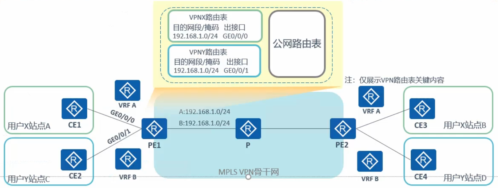
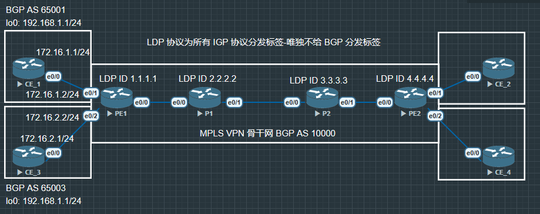

# VRF

- VRF(Virtual Routing and Forwarding, 虚拟路由转发), 又称 VPN 实例, 
**是 MPLS VPN 架构中的关键技术, 每个 VPN 实例使用独立的路由转发表项, 实现 VPN 之间的逻辑隔离.**



## 配置
 
配置 VRF, 绑定端口, 配置 RD, 建立与 CE 的 BGP



```
PE1(config)#ip vrf VPNA

PE1(config)#ip vrf VPNB
```

使用命令 `show ip vr` 可以查看设备上已创立的 VRF, 现在 VRF 处于没有设置 RD, 
也没有分配端口

```
*Dec 15 09:17:06.799: %SYS-5-CONFIG_I: Configured from console by console
PE1#show ip vrf
  Name                             Default RD            Interfaces
  VPNA                             <not set>
  VPNB                             <not set>
```

接下来可以在相对应的接口上配分已经创建好的 VRF

```
PE1(config)#int e0/1
PE1(config-if)#ip vrf forwarding VPNA
PE1(config-if)#ip address 172.16.1.2 255.255.255.0
PE1(config-if)#no shu

PE1(config)#int e0/2
PE1(config-if)#ip vrf forwarding VPNB
PE1(config-if)#ip address 172.16.2.2 255.255.255.0
PE1(config-if)#no shu
```

这个时候再使用命令 `show ip vrf` 就能看到已经绑定了接口

```
PE1#show ip vrf
  Name                             Default RD            Interfaces
  VPNA                             <not set>             Et0/1
  VPNB                             <not set>             Et0/2
```

虽然 PE1 与 CE1, CE3 为直连, 但是 PE1 ping CE1 与 CE2, 
因为此时 PE1 是作为一个全局路由器, PE1 上是没有接口 IP 为 172.16.1.2 与 172.16.2.2 .

必须使用 VRF 来 ping 相应的接口 

```
PE1#ping vrf VPNA 172.16.1.1
Type escape sequence to abort.
Sending 5, 100-byte ICMP Echos to 172.16.1.1, timeout is 2 seconds:
.!!!!
Success rate is 80 percent (4/5), round-trip min/avg/max = 1/1/1 ms
```

### 配置 RD

```
PE1(config)#ip vrf VPNA
PE1(config-vrf)#rd 10000:1

PE1(config)#ip vrf VPNB
PE1(config-vrf)#rd 10000:2

PE1#show ip vrf brief
  Name                             Default RD            Interfaces
  VPNA                             10000:1               Et0/1
  VPNB                             10000:2               Et0/2

```

现在 VRF 中对应的配置已经大致完成

现在只需要与 CE1, CE3 建立 BGP 邻居, 在 CE1, 
CE3 建立 BGP 邻居与正常 BGP 邻居配置方法一致.

在 PE1 中略有不同, 因为不能直接在全局路由器上配置邻居, 需要从对应的 VRF 中去配置邻居

```
PE1(config)#router bgp 10000
PE1(config-router)#bgp router-id 1.1.1.1

PE1(config-router)#address-family ipv4 vrf VPNA
PE1(config-router-af)#neighbor 172.16.1.1 remote-as 65001

PE1(config-router)#address-family ipv4 vrf VPNB
PE1(config-router-af)#neighbor 172.16.2.1 remote-as 65003

*Dec 15 10:25:27.584: %BGP-5-ADJCHANGE: neighbor 172.16.2.1 vpn vrf VPNBUp
```

```
PE1#show ip route vrf VPNA

Routing Table: VPNA
Codes: L - local, C - connected, S - static, R - RIP, M - mobile, B - BGP
       D - EIGRP, EX - EIGRP external, O - OSPF, IA - OSPF inter area
       N1 - OSPF NSSA external type 1, N2 - OSPF NSSA external type 2
       E1 - OSPF external type 1, E2 - OSPF external type 2
       i - IS-IS, su - IS-IS summary, L1 - IS-IS level-1, L2 - IS-IS level-2
       ia - IS-IS inter area, * - candidate default, U - per-user static route
       o - ODR, P - periodic downloaded static route, H - NHRP, l - LISP
       a - application route
       + - replicated route, % - next hop override, p - overrides from PfR

Gateway of last resort is not set

      172.16.0.0/16 is variably subnetted, 2 subnets, 2 masks
C        172.16.1.0/24 is directly connected, Ethernet0/1
L        172.16.1.2/32 is directly connected, Ethernet0/1
B     192.168.1.0/24 [20/0] via 172.16.1.1, 00:06:32
```

```
PE1#show ip route vrf VPNB

Routing Table: VPNB
Codes: L - local, C - connected, S - static, R - RIP, M - mobile, B - BGP
       D - EIGRP, EX - EIGRP external, O - OSPF, IA - OSPF inter area
       N1 - OSPF NSSA external type 1, N2 - OSPF NSSA external type 2
       E1 - OSPF external type 1, E2 - OSPF external type 2
       i - IS-IS, su - IS-IS summary, L1 - IS-IS level-1, L2 - IS-IS level-2
       ia - IS-IS inter area, * - candidate default, U - per-user static route
       o - ODR, P - periodic downloaded static route, H - NHRP, l - LISP
       a - application route
       + - replicated route, % - next hop override, p - overrides from PfR

Gateway of last resort is not set

      172.16.0.0/16 is variably subnetted, 2 subnets, 2 masks
C        172.16.2.0/24 is directly connected, Ethernet0/2
L        172.16.2.2/32 is directly connected, Ethernet0/2
B     192.168.1.0/24 [20/0] via 172.16.2.1, 00:06:24
```

现在在 VPNA 和 VPNB 中都有相同的 192.168.1.0 这条路由.

如果要查看 BGP summary, 因为 VRF 的存在, 所以使用 `show ip bgp summary` 
是没有用的. 需要使用新的命令 `show ip bgp vpnv4 vrf 'NAME'`

```
PE1#show ip bgp vpnv4 vrf VPNA
BGP table version is 3, local router ID is 1.1.1.1
Status codes: s suppressed, d damped, h history, * valid, > best, i - internal,
              r RIB-failure, S Stale, m multipath, b backup-path, f RT-Filter,
              x best-external, a additional-path, c RIB-compressed,
              t secondary path,
Origin codes: i - IGP, e - EGP, ? - incomplete
RPKI validation codes: V valid, I invalid, N Not found

     Network          Next Hop            Metric LocPrf Weight Path
Route Distinguisher: 10000:1 (default for vrf VPNA)
 *>   192.168.1.0      172.16.1.1               0             0 65001 i
```

## RD 

- PE 收到不同 VPN 的 CE 发来的 IPv4 地址前缀, 本地根据 VRF 去区分这些地址前缀. 
但是 VRF 只是一个本地的概念, PE 无法将 VRF 信息传递到对端 PE (PE ➡ PE2), 
所以产生了 RD (Route Distinguisher, 路由区分符)

    - DR 长 8 字节, 用于区分使用相同地址空间的 IPv4 前缀

    - PE 从 CE 接收到 IPv4 路由后, 在 IPv4 前缀前加上 RD, 
    转换为全局唯一个 VPN-IPv4 路由.

|Type Field|Administrator Subfield|Assigned Number Subfield|
|:--------:|:--------------------:|:----------------------:|
|2字节, 不需配置|2字节, 手动配置|4字节, 手动配置|
|Type=0|AS 号|自定义|
|Type=1|IPv4 地址|自定义|

## VPN-IPv4 地址

VPN-IPV4 地址又被称为 VPNv4 地址: VPNv4 地址共有12个字节, 包括8字节的路由标识符RD(
Route Distinguisher) 和4字节的 IPv4 地址前缀

|RD|:|IPv4 地址前缀|
|:---:|:--:|:-----:|
|10000:1|:|192.168.1.0|
|10000:2|:|192.168.1.0|

## 配置

```
PE1(config-router)#no bgp default ipv4-unicast
```

这条命令是为了呼应 VPN-IPv4 地址, Cisco 默认建立邻居会使用IPv4 Unicast 会话, 但是在
MPLS VPN 中, 我们需要传递的是 VPN-IPv4 地址, 所以需要禁用默认的 IPv4-Unicast, 
并且最好在配置邻居前先布置这条命令显得专业.

PE1 与 PE2 建立 BGP 邻居

PE1
```
PE1(config)#router bgp 10000
PE1(config-router)#neighbor 4.4.4.4 remote-as 10000
PE1(config-router)#neighbor 4.4.4.4 update-source lo0
PE1(config-router)#address-family vpnv4
PE1(config-router-af)#neighbor 4.4.4.4 activate

```

PE2
```
PE2(config)#router bgp 10000
PE2(config-router)#no bgp default ipv4-unicast
PE2(config-router)#bgp router-id 4.4.4.4
PE2(config-router)#neighbor 1.1.1.1 remote-as 10000
PE2(config-router)#neighbor 1.1.1.1 update-source lo0
PE2(config-router)#address-family vpnv4
PE2(config-router-af)#neighbor 1.1.1.1 activate
```

同样 PE1 与 P1 建立邻居, P1 可以设置为路由反射器

```
P1(config)#router bgp 10000
P1(config-router)#no bgp default ipv4-unicast
P1(config-router)#neighbor 4.4.4.4 remote-as 10000
P1(config-router)#neighbor 4.4.4.4 update-source lo0
P1(config-router)#address-family vpnv4
P1(config-router-af)#neighbor 4.4.4.4 activate

P1(config-router-af)#neighbor 1.1.1.1 route-reflector-client
P1(config-router-af)#neighbor 4.4.4.4 route-reflector-client
```
如果 P1 不作为 RR 那么整个 MPLS VPN 都不需要 P1 参与, 同样也不需要 P2 参与, 所以 P1 
与 P2 只是作为数据转发. 

由于现在 BGP 使用了 VPNv4 地址, 所以原先的 `show ip bgp summary` 不再有效, 需要使用
`show bgp vpnv4 unicast all summary` 这条新的命令

### RD 值区别私网路由

`show bgp vpnv4 unicast all`

```
PE1#show bgp vpnv4 unicast all
BGP table version is 3, local router ID is 1.1.1.1
Status codes: s suppressed, d damped, h history, * valid, > best, i - internal,
              r RIB-failure, S Stale, m multipath, b backup-path, f RT-Filter,
              x best-external, a additional-path, c RIB-compressed,
              t secondary path,
Origin codes: i - IGP, e - EGP, ? - incomplete
RPKI validation codes: V valid, I invalid, N Not found

     Network          Next Hop            Metric LocPrf Weight Path
Route Distinguisher: 10000:1 (default for vrf VPNA)
 *>   192.168.1.0      172.16.1.1               0             0 65001 i
Route Distinguisher: 10000:2 (default for vrf VPNB)
 *>   192.168.1.0      172.16.2.1               0             0 65003 i
```

可以清晰看到在两条 192.168.1.0 的路由上有一个 Route Distinguisher , 一个 10000:1, 
一个 10000:2.

- BGP-4 仅支持 IPv4 路由, 为了正确处理 VPN 路由, MPLS VPN 使用 RFC 2858(
Multiprotocol Extensions for BGP-4) 中规定的 MP-BGP, 即 BGP-4 的多协议扩展.

- MP-BGP 采用地址族来区分不同的网络层协议, 即可以支持传统的 IPv4 地址族, 哟可以支持其
他的地址族 (VPN-IPv4, IPv6)

- MP-BGP 新增了两种路径属性:
  1. MP_REACH_NLRI: Multiprotocol Reachable NLRI, 多协议可达 NLRI. 
  用于发布可达路由及下一跳信息.

  2. MP_UNREACH_NLRI: Mutiprocotocol Unreachable NLRI, 多协议不可达 NLRI.
  用于撤销不可达路由

|地址族信息域|地址族标识|地址族信息|
|:---------:|:-------:|:-------:|
|下一跳信息域|子地址族标识|地址族信息|
|NLRI域|撤销的路由||
|MP_REACH_NLRI属性的格式|MP_UNREACH_NLRI属性的格式|

### 入口 PE 到出口 PE 路由传递

- MP-BGP 将 VPNv4 传递到远端 PE 之后, 远端 PE 需要将 VPNv4 路由导入正确的 VPN 实例.

- MPLS VPN 使用 BGP 扩展团体属性: VPN Target (也称为 Route Target) 来控制 VPN 路由
信息的发布与接收

- 本地 PE 在发布 VPNv4 路由前附上 ExportRT 属性(扩展团体属性), 对端 PE 在接收到 
VPNv4 路由后根据 ImportRT 将路由导入到对应的 VPN 实例.

在使用抓包软件中可以在 Border Getaway Protocol - UPDATE message 中看到 path 
attributes

## 配置

```
PE1(config)#ip vrf VPNA
PE1(config-vrf)#route-target ?
  ASN:nn or IP-address:nn  Target VPN Extended Community
  both                     Both import and export Target-VPN community
  export                   Export Target-VPN community
  import                   Import Target-VPN community
// 单独设置默认就是both

PE1(config-vrf)#route-target export 88:99

PE1#show run | sec bgp
router bgp 10000
 bgp router-id 1.1.1.1
 bgp log-neighbor-changes
 no bgp default ipv4-unicast
 neighbor 2.2.2.2 remote-as 10000
 neighbor 2.2.2.2 update-source Loopback0
 neighbor 4.4.4.4 remote-as 10000
 neighbor 4.4.4.4 update-source Loopback0
 !
 address-family vpnv4
  neighbor 2.2.2.2 activate
  neighbor 2.2.2.2 send-community extended // 可以看到多了团体属性
  neighbor 4.4.4.4 activate
  neighbor 4.4.4.4 send-community extended
 exit-address-family
 !
 address-family ipv4 vrf VPNA
  neighbor 172.16.1.1 remote-as 65001
  neighbor 172.16.1.1 activate
 exit-address-family
 !
 address-family ipv4 vrf VPNB
  neighbor 172.16.2.1 remote-as 65003

```

(PS: 路由器可以关闭 route-target, `no bgp default route-target`, 不建议关闭)

PE2
```
PE2(config)#ip vrf VPNA
PE2(config-vrf)#rd 10000:3
PE2(config-vrf)#route-target 88:99
PE2(config)#int e0/1
PE2(config-if)#ip vrf forwarding VPNA
PE2(config-if)#ip address 172.16.3.2 255.255.255.0

PE2(config)#ip vrf VPNB
PE2(config-vrf)#rd 10000:4
PE2(config-vrf)#route-target 66:77
PE2(config)#int e0/2
PE2(config-if)#ip vrf forwarding VPNB
PE2(config-if)#ip address 172.16.4.2 255.255.255.0

PE2(config)#router bgp 10000
PE2(config-router)#address-family ipv4 vrf VPNA
PE2(config-router-af)#neighbor 172.16.3.1 remote-as 65002

PE2(config-router)#address-family ipv4 vrf VPNB
PE2(config-router-af)#neighbor 172.16.4.1 remote-as 65004

```
团体属性(RT值)不是唯一的, 可以接受同RD 值但是不同RT 值得路由

```
PE1(config)#ip vrf VPNB
PE1(config-vrf)#route-target 66:77
```

```
PE1(config)#mpls label protocol ldp

PE1(config)#int e0/0
PE1(config-if)#mpls ip
```

在途径所有骨干路由器上都需要执行如上命令

```
CE_3#ping 192.168.2.1 source 192.168.1.1
Type escape sequence to abort.
Sending 5, 100-byte ICMP Echos to 192.168.2.1, timeout is 2 seconds:
Packet sent with a source address of 192.168.1.1
.....
Success rate is 0 percent (0/5)
CE_3#ping 192.168.2.1 source 192.168.1.1
Type escape sequence to abort.
Sending 5, 100-byte ICMP Echos to 192.168.2.1, timeout is 2 seconds:
Packet sent with a source address of 192.168.1.1
!!!!!
Success rate is 100 percent (5/5), round-trip min/avg/max = 1/2/3 ms
```

`show ip vrf detail XXX` 查看 vrf 详情