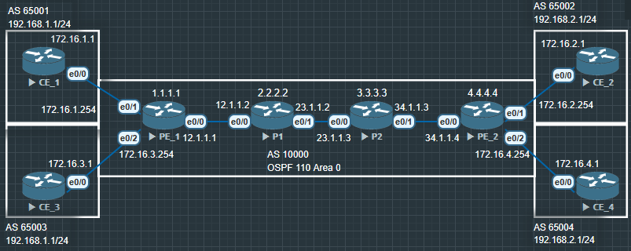
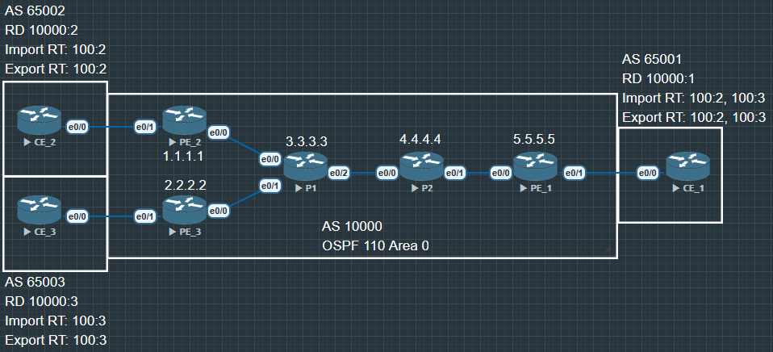
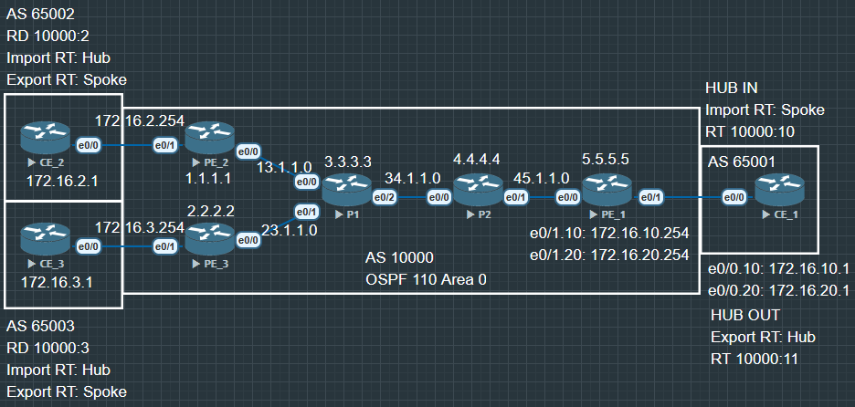

# 回顾

## Intranet



采用 Intranet 组网方案, 一个 VPN 中的所有用户形成闭合用户群, 互相之间能够进行流量转发,
VPN 用户不能与任何本 VPN 以外的用户通信, 其站点通常是属于同一个组织

- Intranet 是 MPLS VPN 的基本组网方式之一, PE 需要为每个站点创建 VPN 实例, 并配置全网
唯一的 RD

- PE 通过配置 Import RT 和 Export RT 来控制不同 VPN 的站点做到无法互访.

eg: 

||RT|RT (Import)|RT (Export)|
|:---:|:-----:|:-----:|:------:|
|CE_1|10000:1|88:99|88:99|
|CE_2|10000:2|88:99|88:99|
|CE_3|10000:3|66:77|66:77|
|CE_4|10000:4|66:77|66:77|

PE 通过 `address-family ipv4 vrf XXX` 来与 CE 建立 BGP 邻居, 通过 MP-BGP,
`address-family vpnv4` 与骨干网上的其他 PE 建立邻居. 从而实现由 RT 控制私网路由的
收发.

PE 通过 `ip vrf XXX` 建立 VRF 并绑定到对应 CE 的接口, 设置相应的 IP, RD, RT.


## Extranet



- CE_1 作为能被 CE_2 和 CE_3 访问的共享站点, 需要保证:
    
    - PE_1 能接收 PE_2 和 PE_3 发布的 VPNv4 路由

    - PE_1 发布的 VPNv4 路由能够被 PE_2 和 PE_3 接收

    - PE_1 不把从 PE_2 和 PE_3 的路由互相传递.

PE_1 的关键配置:

```
PE_1(config)# ip vrf VPN_SHARED
PE_1(config-vrf)# rd 10000:1
PE_1(config-vrf)# route-target both 100:2
PE_1(config-vrf)# route-target both 100:3
```

# Hub&Spoke



- 当采用 Hub&Spoke 方案时, 可以将多个站点中的一个站点设置为 Hub 站点, 其余站点为 
Spoke 站点. 站点间的互访必须通过 Hub 站点, 通过 Hub 站点集中管控站点间的数据传输.

    Spoke 站点需要把路由发布给 Hub 站点, 再通过 Hub 站点发布给其他 Spoke 站点. 
    Spoke 站点之间不直接交互路由信息.

    Spoke_PE 需要设置 Export Target 为 Spoke, Import Target 为 Hub.

    Hub_PE 上需要使用两个接口或子接口(创建两个 VPN 实例), 一个用于接收 Spoke_PE
    发来的路由, 其 VPN 实例的 Import Target: Spoke, 另一个用于向 Spoke_PE 发布路由, 
    其 VPN 实例的 Export Target: Hub.

## 配置 1 骨干基础网络  

- **在实验中优先配置骨干网络**

- 接口IP, 环回地址, 建立OSPF, 打通 LDP 隧道

PE2

```
PE_2(config)#router ospf 110
PE_2(config-router)#router-id 1.1.1.1

PE_2(config)#mpls ldp router-id lo0

PE_2(config)#int e0/0
PE_2(config-if)#ip address 13.1.1.1 255.255.255.0
PE_2(config-if)#no shu
PE_2(config-if)#ip ospf 110 area 0
PE_2(config-if)#mpls ip

PE_2(config)#int lo0
PE_2(config-if)#ip address 1.1.1.1 255.255.255.255
PE_2(config-if)#no shu
PE_2(config-if)#ip ospf 110 area 0

PE_2(config)#mpls ldp neighbor 3.3.3.3 password acc
```

PE3

```
PE_3(config)#router ospf 110
PE_3(config-router)#router-id 2.2.2.2
PE_3(config)#mpls ldp router-id lo0
PE_3(config)#mpls ldp neighbor 3.3.3.3 password acc

PE_3(config)#int lo0
PE_3(config-if)#ip address 2.2.2.2 255.255.255.255
PE_3(config-if)#no shu
PE_3(config-if)#ip ospf 110 area 0

PE_3(config)#int e0/0
PE_3(config-if)#ip address 23.1.1.2 255.255.255.0
PE_3(config-if)#no shu
PE_3(config-if)#ip ospf 110 area 0
PE_3(config-if)#mpls ip
```

P1

```
P1(config)#router ospf 110
P1(config-router)#router-id 3.3.3.3
P1(config)#mpls ldp router-id lo0

P1(config)#int lo0
P1(config-if)#ip address 3.3.3.3 255.255.255.255
P1(config-if)#no shu
P1(config-if)#ip ospf 110 area 0

P1(config)#int e0/0
P1(config-if)#ip address 13.1.1.3 255.255.255.0
P1(config-if)#no shu
P1(config-if)#ip ospf 110 area 0
P1(config-if)#mpls ip

P1(config)#int e0/1
P1(config-if)#ip address 23.1.1.3 255.255.255.0
P1(config-if)#no shu
P1(config-if)#ip ospf 110 area 0
P1(config-if)#mpls ip

P1(config)#int e0/2
P1(config-if)#ip address 34.1.1.3 255.255.255.0
P1(config-if)#no shu
P1(config-if)#ip ospf 110 area 0
P1(config-if)#mpls ip

P1(config)#ip access-list standard LDPAUTH
P1(config-std-nacl)#permit 1.1.1.1
P1(config-std-nacl)#permit 2.2.2.2
P1(config-std-nacl)#permit 3.3.3.3

P1(config)#mpls ldp password option 1 for LDPAUTH acc // 创建密码1 
P1(config)#mpls ldp password required for LDPAUTH   // ACL LDPAUTH 邻居都需要密码1, option 意味着 不同邻居可以设置不同的密码.
```

P2

```
P2(config)#router ospf 110
P2(config-router)#router-id 4.4.4.4
P2(config)#mpls ldp router-id lo0

P2(config)#int lo0
P2(config-if)#ip address 4.4.4.4 255.255.255.255
P2(config-if)#no shu
P2(config-if)#ip ospf 110 area 0

P2(config)#int e0/0
P2(config-if)#ip address 34.1.1.14 255.255.255.0
P2(config-if)#no shu
P2(config-if)#ip ospf 110 area 0
P2(config-if)#mpls ip

P2(config)#mpls ldp neighbor 3.3.3.3 password acc

P2(config)#int e0/1
P2(config-if)#ip address 45.1.1.4 255.255.255.0
P2(config-if)#no shu
P2(config-if)#ip ospf 110 area 0
P2(config-if)#mpls ip
```

PE_1

```
PE_1(config)#router ospf 110
PE_1(config-router)#router-id 5.5.5.5
PE_1(config)#mpls ldp router-id lo0

PE_1(config)#int lo0
PE_1(config-if)#ip address 5.5.5.5 255.255.255.255
PE_1(config-if)#no shu
PE_1(config-if)#ip ospf 110 area 0

PE_1(config)#int e0/0
PE_1(config-if)#ip address 45.1.1.5 255.255.255.0
PE_1(config-if)#no shu
PE_1(config-if)#ip ospf 110 area 0
PE_1(config-if)#mpls ip
```

## 配置 2 PE_2, PE_3 | VRF

配置 VRF (Hub 10000:1, Spoke 10000:2)

PE_2

```
PE_2(config)#ip vrf SPOKE1
PE_2(config-vrf)#rd 10000:2
PE_2(config-vrf)#route-target import 10000:1
PE_2(config-vrf)#route-target export 10000:2

PE_2(config)#int e0/1
PE_2(config-if)#ip vrf forwarding SPOKE1
PE_2(config-if)#ip address 172.16.2.254 255.255.255.0
PE_2(config-if)#no shu
```

PE_3

```
PE_3(config)#ip vrf SPOKE2
PE_3(config-vrf)#rd 10000:3
PE_3(config-vrf)#route-target import 10000:1
PE_3(config-vrf)#route-target export 10000:2

PE_3(config)#int e0/1
PE_3(config-if)#ip vrf forwarding SPOKE2
PE_3(config-if)#ip address 172.16.3.254 255.255.255.0
PE_3(config-if)#no shu
```

## 配置3 配置 PE_2, PE_3 | BGP

PE_2

```
PE_2(config)#router bgp 10000
PE_2(config-router)#bgp router-id 1.1.1.1
PE_2(config-router)#no bgp default ipv4-unicast

PE_2(config-router)#address-family ipv4 vrf SPOKE1
PE_2(config-router-af)#neighbor 172.16.2.1 remote-as 65002

PE_2(config-router)#neighbor 3.3.3.3 remote-as 10000
PE_2(config-router)#neighbor 3.3.3.3 update-source lo0

PE_2(config-router)#address-family vpnv4
PE_2(config-router-af)#neighbor 3.3.3.3 activate
```

PE_3 

```
PE_3(config)#router bgp 10000
PE_3(config-router)#bgp router-id 2.2.2.2
PE_3(config-router)#no bgp default ipv4-unicast

PE_3(config-router)#address-family ipv4 vrf SPOKE2
PE_3(config-router-af)#neighbor 172.16.3.1 remote-as 65003

PE_3(config-router)#neighbor 3.3.3.3 remote-as 10000
PE_3(config-router)#neighbor 3.3.3.3 update-source lo0

PE_3(config-router)#address-family vpnv4
PE_3(config-router-af)#neighbor 3.3.3.3 activate
```

## 配置 CE

CE_2

```
CE_2(config)#int lo0
CE_2(config-if)#ip address 192.168.2.1 255.255.255.0
CE_2(config-if)#no shu

CE_2(config)#int e0/0
CE_2(config-if)#ip address 172.16.2.1 255.255.255.0
CE_2(config-if)#no shu

CE_2(config)#router bgp 65002
CE_2(config-router)#bgp router-id 192.168.2.1
CE_2(config-router)#neighbor 172.16.2.254 remote-as 10000
CE_2(config-router)#network 192.168.2.0 mask 255.255.255.0
```

CE_3

```
CE_3(config)#int lo0
CE_3(config-if)#ip address 192.168.3.1 255.255.255.0
CE_3(config-if)#no shu

CE_3(config)#int e0/0
CE_3(config-if)#ip address 172.16.3.1 255.255.255.0
CE_3(config-if)#no shu

CE_3(config)#router bgp 65003
CE_3(config-router)#bgp router-id 192.168.3.1
CE_3(config-router)#neighbor 172.16.3.254 remote-as 10000
CE_3(config-router)#network 192.168.3.0 mask 255.255.255.0
```

CE_1

```
CE_1(config)#int lo0
CE_1(config-if)#ip address 192.168.1.1 255.255.255.0
```

## 配置 P1 路由反射

P1

```
P1(config)#router bgp 10000
P1(config-router)#bgp router-id 3.3.3.3
P1(config-router)#no bgp default ipv4-unicast

P1(config-router)#neighbor 1.1.1.1 remote-as 10000
P1(config-router)#neighbor 1.1.1.1 update-source lo0

P1(config-router)#neighbor 2.2.2.2 remote-as 10000
P1(config-router)#neighbor 2.2.2.2 update-source lo0

P1(config-router)#neighbor 5.5.5.5 remote-as 10000
P1(config-router)#neighbor 5.5.5.5 update-source lo0

P1(config-router)#address-family vpnv4 

P1(config-router-af)#neighbor 1.1.1.1 activate
P1(config-router-af)#neighbor 1.1.1.1 route-reflector-client

P1(config-router-af)#neighbor 2.2.2.2 activate
P1(config-router-af)#neighbor 2.2.2.2 route-reflector-client

P1(config-router-af)#neighbor 5.5.5.5 activate
P1(config-router-af)#neighbor 5.5.5.5 route-reflector-client
```

## 配置 HUB PE, CE

PE_1

```
PE_1(config)#ip vrf HUBIN
PE_1(config-vrf)#rd 10000:10
PE_1(config-vrf)#route-target import 10000:2

PE_1(config)#int e0/1
PE_1(config-if)#no shu

PE_1(config)#int e0/1.10
PE_1(config-subif)#encapsulation dot1Q 10
PE_1(config-subif)#ip vrf forwarding HUBIN
PE_1(config-subif)#ip address 172.16.10.254 255.255.255.0
PE_1(config-subif)#no shu

PE_1(config)#ip vrf HUBOUT
PE_1(config-vrf)#rd 10000:11
PE_1(config-vrf)#route-target export 10000:1

PE_1(config)#int e0/1.20
PE_1(config-subif)#encapsulation dot1Q 20
PE_1(config-subif)#ip vrf forwarding HUBOUT
PE_1(config-subif)#ip address 172.16.20.254 255.255.255.0
PE_1(config-subif)#no shu
```

**设置 PE_1 BGP**

```
PE_1(config)#router bgp 10000
PE_1(config-router)#bgp router-id 5.5.5.5
PE_1(config-router)#no bgp default ipv4-unicast

PE_1(config-router)#neighbor 3.3.3.3 remote-as 10000
PE_1(config-router)#neighbor 3.3.3.3 update-source lo0

PE_1(config-router)#address-family vpnv4
PE_1(config-router-af)#neighbor 3.3.3.3 activate

PE_1(config-router)#address-family ipv4 vrf HUBIN
PE_1(config-router-af)#neighbor 172.16.10.1 remote-as 65001

PE_1(config-router)#address-family ipv4 vrf HUBOUT
PE_1(config-router-af)#neighbor 172.16.20.1 remote-as 65001
```

## 配置 CE_1

CE_1

```
CE_1(config)#int e0/0
CE_1(config-if)#no shu

CE_1(config)#int e0/0.10
CE_1(config-subif)#encapsulation dot1Q 10
CE_1(config-subif)#ip address 172.16.10.1 255.255.255.0
CE_1(config-subif)#no shu

CE_1(config)#int e0/0.20
CE_1(config-subif)#encapsulation dot1Q 20
CE_1(config-subif)#ip address 172.16.20.1 255.255.255.0
CE_1(config-subif)#no shu
```

**设置 CE_1 BGP**

```
CE_1(config)#router bgp 65001
CE_1(config-router)#bgp router-id 192.168.1.1

CE_1(config-router)#neighbor 172.16.10.254 remote-as 10000
CE_1(config-router)#neighbor 172.16.20.254 remote-as 10000
```

## 重点配置 

**由于 BGP 防环规则, 不会接收相同 AS 的路由, 要实现 MPLS VPN Hub&Spoke 就必须打破这个规则.**

**现在就需要 HUBOUT 接收这个重复 AS 的 BGP 路由**

PE_1

```
PE_1(config)#router bgp 10000
PE_1(config-router)#address-family ipv4 vrf HUBOUT
PE_1(config-router-af)#neighbor 172.16.20.1 allowas-in ?
  <1-10>  Number of occurances of AS number
  <cr>
// 数字代表相同 AS 号能出现几次, 默认是1
PE_1(config-router-af)#neighbor 172.16.20.1 allowas-in 1
```
## 验证

```
CE_2#traceroute 192.168.3.1 source 192.168.2.1
Type escape sequence to abort.
Tracing the route to 192.168.3.1
VRF info: (vrf in name/id, vrf out name/id)
  1 172.16.2.254 0 msec 0 msec 0 msec
  2 13.1.1.3 [MPLS: Labels 20/23 Exp 0] 1 msec 1 msec 1 msec
  3 34.1.1.14 [MPLS: Labels 21/23 Exp 0] 1 msec 1 msec 1 msec
  4 172.16.20.254 [MPLS: Label 23 Exp 0] 1 msec 2 msec 1 msec
  5 172.16.20.1 1 msec 2 msec 1 msec
  6 172.16.10.254 0 msec 2 msec 0 msec
  7 45.1.1.4 [MPLS: Labels 20/23 Exp 0] 2 msec 4 msec 2 msec
  8 34.1.1.3 [MPLS: Labels 19/23 Exp 0] 1 msec 3 msec 2 msec
  9 172.16.3.254 [MPLS: Label 23 Exp 0] 1 msec 5 msec 2 msec
 10 172.16.3.1 1 msec 2 msec *
```