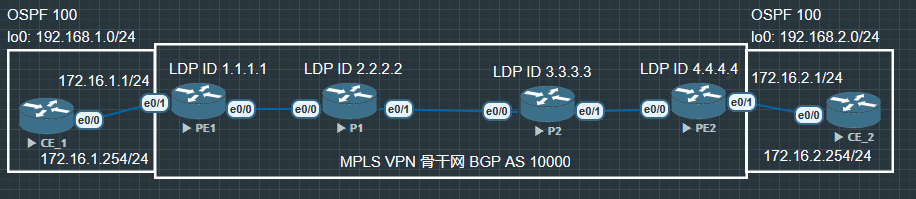

# OSPF Superbackbone

过时技术, 由于金融等行业还拥有传统屎山, 所以现今可能依旧还有公司在使用超级骨干

在传统的 OSPF 规则里，所有的非骨干区域（Area 1, Area 2 等）必须连接到 Area 0。但是在 MPLS VPN 环境下，中间隔着庞大的 ISP 骨干网。

Superbackbone 技术就是让中间的整个 MP-BGP 隧道网络“伪装”成一个透明的、高一级的 Area 0。它允许 PE 路由器把 OSPF 的各种原生属性（如 LSA 类型、Metric 值、路由标记等）打包塞进 BGP 属性中透传，从而欺骗两端的 CE 路由器，让它们以为彼此是通过同一个 OSPF 骨干区域相连的。



## 配置

CE1

```
CE_1(config)#router ospf 100
CE_1(config-router)#router-id 192.168.1.1

CE_1(config)#int lo0
CE_1(config-if)#ip address 192.168.1.1 255.255.255.0
CE_1(config-if)#no shu
CE_1(config-if)#ip ospf 100 area 0

CE_1(config)#int e0/0
CE_1(config-if)#ip address 172.16.1.1 255.255.255.0
CE_1(config-if)#no shu
CE_1(config-if)#ip ospf 100 a 0
```

PE1

```
PE1(config)#router ospf 110
PE1(config-router)#router-id 1.1.1.1

PE1(config)#int e0/0
PE1(config-if)#ip address 12.1.1.1 255.255.255.0
PE1(config-if)#no shu
PE1(config-if)#ip o 110 a 0

PE1(config-if)#int lo0
PE1(config-if)#ip address 1.1.1.1 255.255.255.255
PE1(config-if)#no shu
PE1(config-if)#ip o 110 a 0

PE1(config)#ip vrf VPNA
PE1(config-vrf)#rd 10000:1
PE1(config-vrf)#route-target 88:99

PE1(config)#router ospf 100 vrf VPNA
PE1(config-router)#router-id 172.16.1.254
PE1(config-router)#redistribute bgp 10000 subnets

PE1(config-if)#int e0/1
PE1(config-if)#ip vrf forwarding VPNA
PE1(config-if)#ip address 172.16.1.254 255.255.255.0
PE1(config-if)#no shu
PE1(config-if)#ip ospf 100 area 0

PE1(config)#router bgp 10000
PE1(config-router)#bgp router-id 1.1.1.1
PE1(config-router)#no bgp default ipv4-unicast

PE1(config-router)#neighbor 2.2.2.2 remote-as 10000
PE1(config-router)#neighbor 2.2.2.2 update-source lo0

PE1(config-router)#address-family vpnv4
PE1(config-router-af)#neighbor 2.2.2.2 activate

PE1(config-router)#address-family ipv4 vrf VPNA
PE1(config-router-af)#redistribute ospf 100

PE1(config)#mpls ldp router-id lo0
PE1(config)#int e0/0
PE1(config-if)#mpls ip

```

P1

```
P1(config)#router ospf 110
P1(config-router)#router-id 2.2.2.2

P1(config)#int lo0
P1(config-if)#ip address 2.2.2.2 255.255.255.255
P1(config-if)#no shu
P1(config-if)#ip o 110 a 0

P1(config-if)#int e0/0
P1(config-if)#ip address 12.1.1.2 255.255.255.0
P1(config-if)#no shu
P1(config-if)#ip o 110 a 0

P1(config-if)#int e0/1
P1(config-if)#ip address 23.1.1.2 255.255.255.0
P1(config-if)#no shu
P1(config-if)#ip o 110 a 0

P1(config)#router bgp 10000
P1(config-router)#no bgp default ipv4-unicast
P1(config-router)#neighbor 1.1.1.1 remote-as 10000
P1(config-router)#neighbor 1.1.1.1 update-source lo0

P1(config-router)#neighbor 4.4.4.4 remote-as 10000
P1(config-router)#neighbor 4.4.4.4 update-source lo0

P1(config-router)#address-family vpnv4

P1(config-router-af)#neighbor 1.1.1.1 activate
P1(config-router-af)#neighbor 1.1.1.1 route-reflector-client

P1(config-router-af)#neighbor 4.4.4.4 activate
P1(config-router-af)#neighbor 4.4.4.4 route-reflector-client

P1(config)#mpls ldp router-id lo0
P1(config)#int range e0/0 -1
P1(config-if-range)#mpls ip
```

P2

```
P2(config)#router ospf 110
P2(config-router)#router-id 3.3.3.3

P2(config)#int lo0
P2(config-if)#ip address 3.3.3.3 255.255.255.255
P2(config-if)#no shu
P2(config-if)#ip o 110 a 0

P2(config-if)#int e0/0
P2(config-if)#ip address 23.1.1.3 255.255.255.0
P2(config-if)#no shu
P2(config-if)#ip o 110 a 0

P2(config-if)#int e0/1
P2(config-if)#ip address 34.1.1.3 255.255.255.0
P2(config-if)#no shu
P2(config-if)#ip o 110 a 0

P2(config)#mpls ldp router-id lo0
P2(config)#int range e0/0-1
P2(config-if-range)#mpls ip
```

PE2

```
PE2(config)#router ospf 110
PE2(config-router)#router-id 4.4.4.4

PE2(config)#int lo0
PE2(config-if)#ip address 4.4.4.4 255.255.255.255
PE2(config-if)#no shu
PE2(config-if)#ip o 110 a 0

PE2(config-if)#int e0/0
PE2(config-if)#ip address 34.1.1.4 255.255.255.0
PE2(config-if)#no shu
PE2(config-if)#ip o 110 a 0

PE2(config)#ip vrf VPNB
PE2(config-vrf)#rd 10000:2
PE2(config-vrf)#route-target 88:99

PE2(config)#router ospf 100 vrf VPNB
PE2(config-router)#router-id 172.16.2.254
PE2(config-router)#redistribute bgp 10000 subnets

PE2(config-vrf)#int e0/1
PE2(config-if)#ip vrf forwarding VPNB
PE2(config-if)#ip address 172.16.2.254 255.255.255.0
PE2(config-if)#no shu
PE2(config-if)#ip ospf 100 a 0

PE2(config)#router bgp 10000
PE2(config-router)#bgp router-id 4.4.4.4
PE2(config-router)#no bgp default ipv4-unicast

PE2(config-router)#neighbor 2.2.2.2 remote-as 10000
PE2(config-router)#neighbor 2.2.2.2 update-source lo0

PE2(config-router)#address-family vpnv4
PE2(config-router-af)#neighbor 2.2.2.2 activate

PE2(config-router-af)#address-family ipv4 vrf VPNB
PE2(config-router-af)#redistribute ospf 100

PE2(config)#mpls ldp router-id lo0
PE2(config)#int e0/0
PE2(config-if)#mpls ip
```

CE2

```
CE2(config)#router ospf 100
CE2(config-router)#router-id 172.16.2.1
CE2(config-router)#ex

CE2(config)#int lo0
CE2(config-if)#ip address 192.168.2.1 255.255.255.0
CE2(config-if)#no shu
CE2(config-if)#ip o 100 a 0

CE2(config-if)#int e0/0
CE2(config-if)#ip add 172.16.2.1 255.255.255.0
CE2(config-if)#no shu
CE2(config-if)#ip o 100 a 0
```

```
CE2#ping 192.168.1.1 source 192.168.2.1
Type escape sequence to abort.
Sending 5, 100-byte ICMP Echos to 192.168.1.1, timeout is 2 seconds:
Packet sent with a source address of 192.168.2.1
!!!!!
Success rate is 100 percent (5/5), round-trip min/avg/max = 1/1/2 ms
```