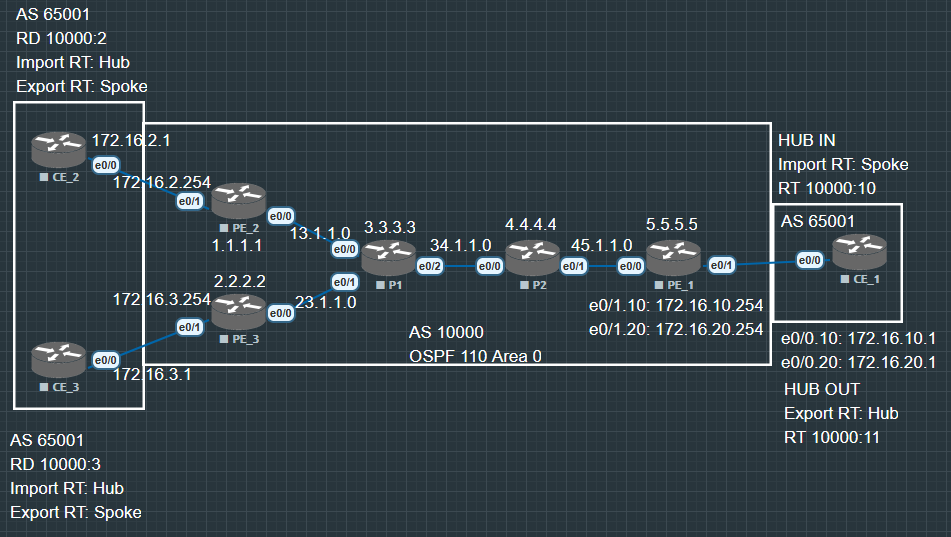

# SoO Site of Orign

1. 在标准的 BGP 选路中, 我们依靠 AS_Path 来防环. 但在 MPLS VPN 环境下, 如果一个客户站点（Site）通过两台 CE 连接到不同的 PE（双上行）, 就会产生隐患:

    - 环路场景: PE-1 从 CE-1 收到一条路由, 传给 PE-2, PE-2 再传给 CE-2. 

    - 结果: CE-2 绕了一圈又收到了自己站点始发的路由. 如果 CE-2 把这条路由又传回给 PE-2 或其他邻居, 轻则次优路径, 重则路由环路. 

2. SoO 是一种 BGP 扩展团体属性 (Extended Community). 它的逻辑非常简单:“打标签, 看标签”. 

    - 打标签（Tagging）: 当 PE 从 CE 接收路由时, 给这条路由打上一个唯一的 SoO 标识（代表这个站点）. 

    - 看标签（Filtering）: 当 PE 准备把路由发给某个 CE 时, 先检查路由带的 SoO 是否与该接口配置的 SoO 一致. 如果一致, 说明这路由本来就是从我这个家（Site）出去的, 现在要回来？拒收！
    
    


在这个拓扑中, 虽然 CE1 与 CE2 没有连接, 但是从 MPLS SPOKE & HUB 的逻辑上说依旧是存在环路了, 因为在 PE_1 上配置了 override, 所以 CE1 会把 CE2, CE3 传给他的路由又分别传回CE2, CE3 造成逻辑环路. as-override 杀死了 BGP 用于防环的 AS-Path, 所以现在需要使用 SoO.

## 基础配置

[参照 as-override](Hub_and_Spoke_override.md)

现在因为 PE2 和 PE3 都在 AS 65001 中, 在实际上他们可能是直接互联, 或者通过别的设备实现互联, 在在这个 MPLS VPN 中就不需 CE2 和 CE3 互传彼此路由, 因为这样就导致了环路. 

所以设置 SoO 为 10000:11, PE2 和 PE3 把传往 PE1 的路由都打上 10000:11 的标记, 并且不再接收相同标记的路由.

## SoO 配置

```
PE_2(config)#router bgp 10000
PE_2(config-router)#address-family ipv4 vrf SPOKE

PE_2(config-router-af)#neighbor 172.16.2.1 soo 10000:11
```

## SoO **route-map** 配置

```
PE_3(config)#route-map SET_SOO permit 10
PE_3(config-route-map)#set extcommunity soo 10000:11

PE_3(config)#router bgp 10000
PE_3(config-router)#address-family ipv4 vrf SPOKE

PE_3(config-router-af)#neighbor 172.16.3.1 route-map SET_SOO in
```

## 验证

