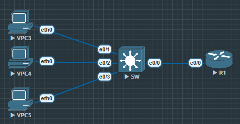

接入层安全非常重要的一项技术就是**端口安全**

# 三种模式

1. protect 丢弃数据包, 不产生日志

2. restrict 丢弃数据包, 产生日志

3. shutdown 丢弃数据包, 产生日志并禁用端口

## 配置

```
Switch(config)#vlan 10

Switch(config)#int vlan 10
Switch(config-if)#ip add 192.168.1.254 255.255.255.0
Switch(config-if)#no shu

Switch(config)#int range e0/1-3
Switch(config-if-range)#switchport mode access
Switch(config-if-range)#switchport access vlan 10

Switch(config)#ip dhcp pool users
Switch(dhcp-config)#network 192.168.1.0 /24

// 这个时候让 PC 去拿 DHCP 地址

Switch#show mac address-table
          Mac Address Table
-------------------------------------------

Vlan    Mac Address       Type        Ports
----    -----------       --------    -----
   1    aabb.cc00.1000    DYNAMIC     Et0/0
  10    0050.7966.6803    DYNAMIC     Et0/1
  10    0050.7966.6804    DYNAMIC     Et0/2
  10    0050.7966.6805    DYNAMIC     Et0/3
Total Mac Addresses for this criterion: 4
```

现在在 SW 的 MAC 表里可以看到所有对应端口设备的 MAC 地址

```
Switch(config)#int range e0/1-3
Switch(config-if-range)#
Switch(config-if-range)#sw
Switch(config-if-range)#switchport po
Switch(config-if-range)#switchport port-security  ?
  aging        Port-security aging commands //设置老化时间
  mac-address  Secure mac address           //指定 接受或拒绝MAC 地址
  maximum      Max secure addresses         //最多接受几个 MAC 地址
  violation    Security violation mode      //违反规则(三种)
  <cr>

Switch(config-if-range)#switchport port-security
```

### 验证

`show port-security' 可以看到当前设置

```
Switch#show port-security
Secure Port  MaxSecureAddr  CurrentAddr  SecurityViolation  Security Action
                (Count)       (Count)          (Count)
---------------------------------------------------------------------------
      Et0/1              1            0                  0         Shutdown
      Et0/2              1            0                  0         Shutdown
      Et0/3              1            0                  0         Shutdown
---------------------------------------------------------------------------
Total Addresses in System (excluding one mac per port)     : 0
Max Addresses limit in System (excluding one mac per port) : 4096
```

现在把原来的 VPC3 换为一个新的 VPC6, 就能发现无法接入交换机了

---

如果要配置一个端口允许多个 MAC 地址

`switchport port-security maximum [number]`
`switchport port-security mac-address [address]`

```
Switch#show errdisable recovery
ErrDisable Reason            Timer Status
-----------------            --------------
arp-inspection               Disabled
bpduguard                    Disabled
channel-misconfig (STP)      Disabled
dhcp-rate-limit              Disabled
dtp-flap                     Disabled
gbic-invalid                 Disabled
inline-power                 Disabled
l2ptguard                    Disabled
link-flap                    Disabled
mac-limit                    Disabled
link-monitor-failure         Disabled
loopback                     Disabled
oam-remote-failure           Disabled
pagp-flap                    Disabled
port-mode-failure            Disabled
pppoe-ia-rate-limit          Disabled
psecure-violation            Disabled
security-violation           Disabled
sfp-config-mismatch          Disabled
storm-control                Disabled
udld                         Disabled
```

errdisable recovery cause psecure-violation

errdisable recovery interval 30