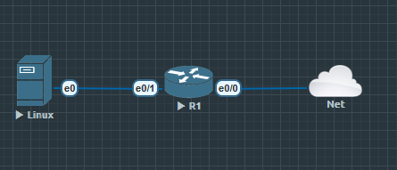
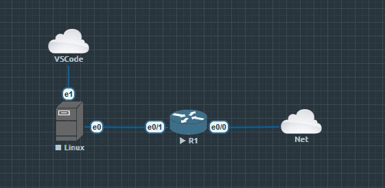

Network 选择 Management(Cloud0)

Linux 密码 Test123

# R1 设置

```
R1(config)#int e0/0
R1(config-if)#ip address dhcp
R1(config-if)#no shu

R1(config)#int e0/1
R1(config-if)#ip add 10.10.10.1 255.255.255.0
R1(config-if)#no shu
R1(config-if)#ex

R1(config)#ip domain name lab.local

R1(config)#username admin privilege 15 secret cisco123

R1(config)#enable secret cisco123

R1(config)#crypto key generate rsa modulus 2048

R1(config)#ip ssh version 2

R1(config)#line vty 0 4
R1(config-line)#login local
R1(config-line)#transport input ssh
```

`ip domain` 设置一个路由域名

Cisco 生成密钥时,密钥的名字是用 主机名.域名, 这里就是 R1.lab.local

`username xx privilege xx secret xx` privilege 越大权限越高

`enable secret` 进入特权模式的密码

`crypto key generate rsa modulus xx` 这是 SSH 的核心——生成一对 RSA 密钥(公钥+私钥).

`modulus 2048` 是密钥长度(位)。这是开启 SSH 的真正开关——没有密钥

SSH 服务根本起不来, 光配 ip ssh version 2 没用

`ip ssh version 2` 强制使用该版本

```
line vty 0 4
 login local
 transport input ssh
```

VTY = Virtual Teletype,虚拟终端线路

就是远程登录(Telnet/SSH)进设备时占用的"逻辑线路"

0 4 表示线路 0 到 4, 共 5 条 意味着最多同时 5 个远程会话

## Linux

```
ip a //查看本机有哪些网卡

sudo ip addr add 10.10.10.100/24 dev ens3   # 给网卡配 IP(L3)
sudo ip link set ens3 up                     # 启用网卡(L2)
```

这样添加的 ip 是临时的, 每次重启后都需要再次设置 ip

```
ls /etc/netplan/
cat /etc/netplan/*.yaml
```
查看 ip 地址由什么在管理

比如

```
Let NetworkManager manage all devices on this system
network:
    version: 2
    renderer: NetworkManager
```

```
# 给 ens3 建一个静态配置
sudo nmcli connection add type ethernet con-name ens3-static ifname ens3 \
  ip4 10.10.10.100/24

# 立即启用
sudo nmcli connection up ens3-static
```

```
ip a show ens3        # 应看到 10.10.10.100
ping -c2 10.10.10.1
```

## 编写 Python 脚本

直接在 EVE-NG 里的 Linux 写太痛苦了, 编辑 Linux 的 Ethernets 为2

添加一个网桥



```
sudo apt install openssh-server -y
sudo systemctl enable --now ssh

sudo systemctl status ssh //验证

  sudo ufw allow 22/tcp //如果不对就放行 端口22
```
1. Ctrl+Shift+P 打开命令面板

2. 输 `Remote-SSH: Connect to Host` → 回车

3. 选 + `Add New SSH Host`

4. 输入:`ssh user@x.x.x.x` → 回车

5. 选保存到 C:\Users\xxx\.ssh\config(你的用户名是 xxx)

6. 右下角弹提示 → 点 Connect(或再次 Connect to Host 选这台)

7. 第一次问指纹 → Continue;然后输 user 的密码

8. 左下角变成绿色 SSH: x.x.x.x = 连上了
